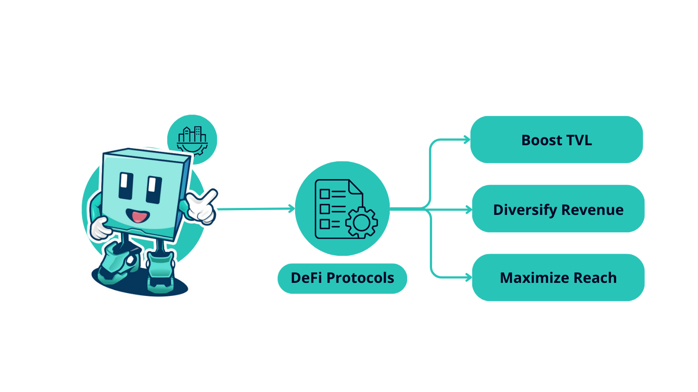
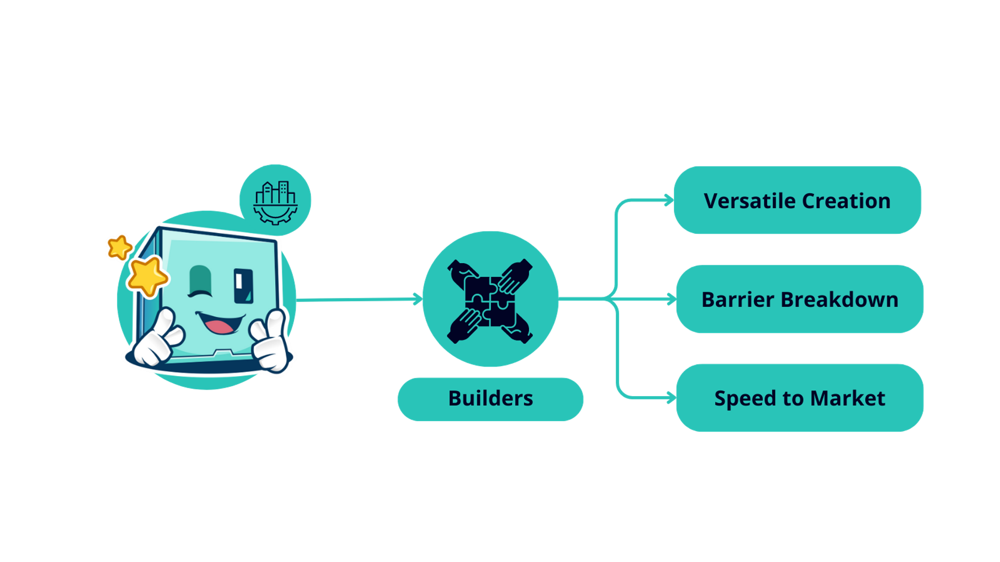
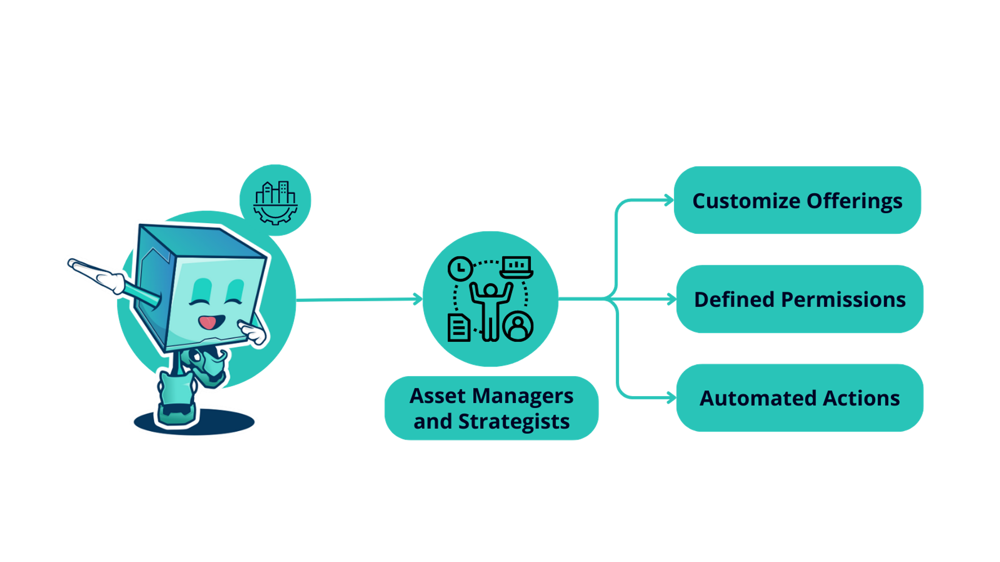

# 🏭 Introduction to Factor


**Arbitrum Foundation LTIPP Distribution Ongoing**

ARB liquidity incentives from the [ArbitrumDAO](https://arbitrum.foundation/) are currently being distributed to Factor strategy depositors via [Factor Boost](governance/factor-boost/).  LTIPP strategy allocations are directed by the Factor community via [Factor Scale](governance/factor-scale/) votes.

Please visit [Arbitrum Foundation LTIPP ](governance/factor-scale/arbitrum-foundation-ltipp.md)for further details on how Factor is collectively building the future of DeFi on Arbitrum.


## Building The Composable Layer Of DeFi

<figure><figcaption>
Factor Solutions
</figcaption></figure>

Factor is realising a future where building and automating complex DeFi strategies are as simple as a drag-and-drop, no coding required. At Factor, we are democratising access to open and permissionless financial rails by equipping users with powerful but intuitive tools that abstracts the intricacies of getting cross-protocol DeFi strategies to market. Factor promotes a thriving DeFi community by empowering users to create shareable strategies that are open to all.

* **Strategy Creators:** Combine varying strategies from multiple DeFi protocols into one automated strategy using [Factor Studio](factor-studio/factor-studio.md)'s drag-and-drop interface.
* **Strategy Managers:** Have what it takes to consistently create successful strategies? Shorten your time to market and earn more fees by allowing users to deposit to your automated strategies.
* **Depositors:** Participate in professionally-managed and community-curated strategies by depositing funds into automated strategy vaults on [Factor Discover](factor-discover/factor-discover/) to earn passive yield.
* **Developers:** Leverage the [Factor SDK](factor-sdk/factor-sdk.md) to effortlessly create custom strategies directly on your app or backend without having to worry about protocol integration specifics.
* **Protocols & DAOs:** Generate permissionless protocol incentives and distribution systems with ease while benefitting from Factor's revenue share or partnership funds.
* **Factorians:** Stake [FCTR](governance/fctr-token/) and participate in building the future of Factor while earning long term protocol incentives.

With integrations across multiple protocols, Factor is a user-friendly and secure gateway to the rest of DeFi. All of Factor's smart contracts are audited by [PeckShield](security/audits/peckshield/) & [SourceHat](security/audits/sourcehat/) with live contracts being [actively monitored by Chainalysis](security/security.md#continuous-monitoring-and-incident-response). Whether you're a protocol, treasury, builder, or individual strategist, Factor streamlines your path to financial autonomy, ensuring a seamless journey for all.

Factor is governed by the [FactorDAO](governance/factordao/), a community-owned platform that empowers [FCTR](governance/fctr-token/#fctr) token holders to participate in the governance of the protocol. By aligning protocol growth with long-term individual incentives, the [FactorDAO](governance/factordao/) places [FCTR](governance/fctr-token/#fctr) holders at the center of Factor’s future. FactorDAO consensus guides the direction of the Factor team which operates a fully remote ream with \~25 builders spread around the globe.

## Factor Solutions


**Factor Stack**

Toggle between the tabs below for a complete overview of all the Factor Solutions and how they combine to make DeFi more accessible!




* [**Factor Studio**](factor-studio/factor-studio.md)**:** One-stop platform for creating Accessible, Composable, and Efficient DeFi strategies. Factor Studio reimagines how DeFi strategies can be created and shared via creating synergies between various Factor products.
* [**Factor Discover**](factor-discover/factor-discover/): Explore and participate in a diverse array of permissionless and curated DeFi strategies. With easy access to an ever expanding pool of DeFi strategies, Factor Discover greatly simplifies the process of finding suitable opportunities based on personalized preferences and goals.
* [**Factor Building Blocks**](./#factor-building-blocks)**:** Simplifying DeFi strategy creation by abstracting the complexity of comparable protocols into a single intent-based interface. Building Blocks allow users to focus on strategy creation without having to worry about the exact details of strategy implementation across protocols.
* [**Factor Adapters**](./#factor-adapters)**:** Enabling Factor Studio to securely and permissionlessly interact with external DeFi protocols on-chain. Factor Adapters generalizes core financial operations by implementing protocol-specific smart contracts that interface directly with external protocol smart contracts.
* [**Factor SDK**](./#factor-sdk)**:** A versatile developer toolkit packed with features to assist you in the entire journey of developing, deploying, and managing custom trading strategies on the Factor platform. Instead of manually integrating with each protocol, developers can utilize the SDK’s modular building blocks.
* [**Factor Scale**](governance/factor-scale/)**:** Stake [FCTR](governance/fctr-token/#fctr) and be eligible to vote on the distribution of weekly gauge rewards to different vaults created on Factor. Factor Scale democratizes the allocation of protocol rewards via allowing [veFCTR](governance/fctr-token/#vefctr) holders to direct protocol emissions through community voting.
* [**Factor Boost**](governance/factor-boost/)**:** Allocate any ERC20 token as additional rewards for depositors in a target strategy vault. Just select a target vault as well as a whitelisted ERC20 reward token and Factor Boost will automatically apportion the reward tokens to vault depositors.



<figure><figcaption>
Factor Stack
</figcaption></figure>



### Partners Include

<figure><figcaption></figcaption></figure>

The full list of official partners can be found at the following link:



## Use Cases

DeFi Protocols

Expand your product suite and grow your ecosystem. With Factor Studio, you can:

* **Boost TVL**: Offer unique strategies that lure users, promoting a cycle of increased visibility and capital inflow.
* **Diversify Revenue**: Monetize custom strategies and structures tailored to your assets, and tap into new revenue streams through incentives.
* **Maximize Reach**: Leverage Factor's extensive network to showcase your innovations to a broader audience.
* **Governance Blackholes**: Easily launch governance blackholes to kickstart ‘wars’ and bribe markets for the protocol’s native token.

Builders

Transform your ideas into reality using Factor Studio's user-friendly interface.

* **Versatile Creation**: Studio's modular design is not limited to traditional DeFi structures; it opens up boundless possibilities, ranging from single to multi-asset yield, with or without leverage.
* **Barrier Breakdown**: Studio's intuitive interface bridges the gap between idea and execution, allowing even those without extensive coding experience to build and deploy sophisticated DeFi strategies. This paves the way for more innovative projects entering the ecosystem.
* **Speed to Market**: Accelerate the journey to MVP and beyond with Factor Studio. Speed up your development process, enabling you to swiftly launch your project and find your product-market fit.

Asset Managers/Strategists

Leverage Factor’s infrastructure to launch new vehicles and grow TVL:

* **Customize Offerings**: Design and oversee products and strategies tailored to specific mandates, either using the interface or the SDK.
* **Defined Permissions**: Permissions can be configured to accept deposits only from pre-approved wallet addresses. This allows the implementation of regulatory processes like KYC in compliance with your jurisdiction's requirements.
* **Automated Actions**: Factor's programmatic building blocks can automate actions like portfolio rebalancing, following predefined rules and logic for seamless execution.

Depositors

Whether you are a treasury manager, on-chain fund, or an individual, Factor serves as a gateway to a vast ecosystem of tailored opportunities and projects.

* **Customized Allocation Pathways**: Every strategy has its nuances. With Factor, you have all the tools you need to select strategies that align with your specific risk parameters, objectives, and asset inclinations.
* **Efficient Exploration with Layered Filtering**: Skip the tedious deep dives and manual sifting. Factor's advanced filters quickly direct you to the most promising strategies that match your specific criteria.
* **Stay at the Forefront**: The DeFi landscape is constantly evolving. With Factor, you're always up-to-date with the latest strategies and innovations in the ecosystem.

