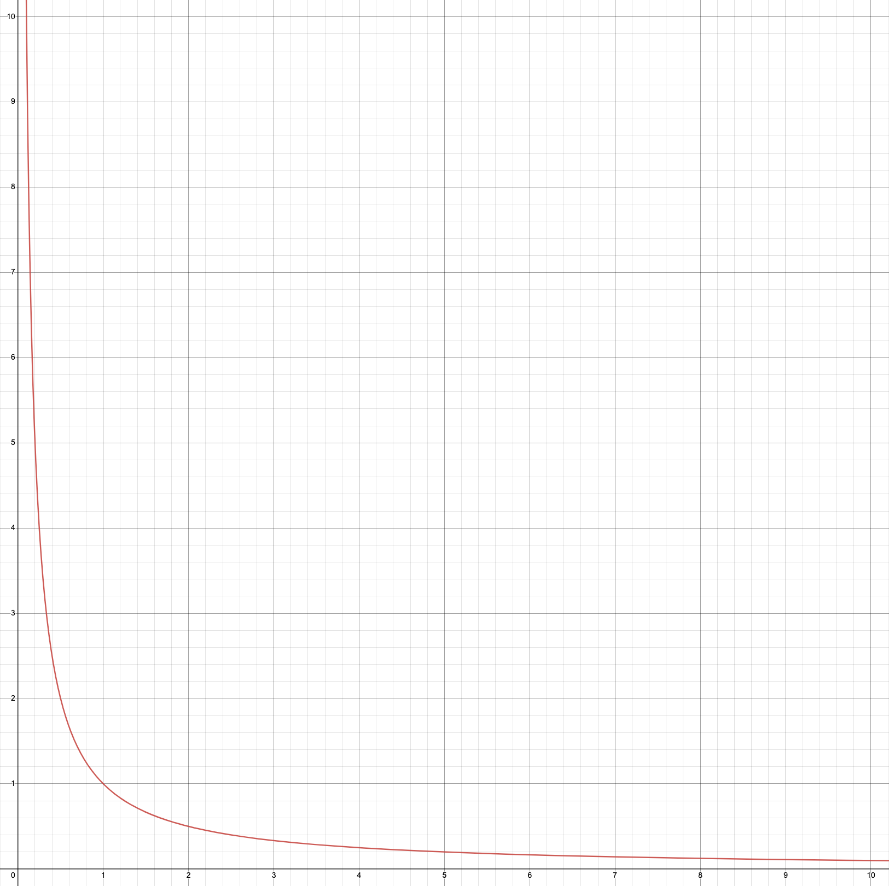

# Automated Market Maker

## Overview

Per its namesake, Automated Market Maker (AMM) DEXs maintains a liquidity pool of assets against which trades can be made automatically along a pricing curve. Asset holders are incentivised to provide their tokens to the liquidity pool smart contract in exchange for a portion of the trading fees. In this case, AMM liquidity is generated when token holders lock their tokens in a liquidity pool in exchange for a percentage return on their assets. Generally speaking, the more liquidity locked in a pool, the larger the pool size relative to a trade which results in lesser slippage.

In the pursuit of greater capital efficiency, many AMMs have also implemented their own price curve formulas that enable more fine-grained tuning of liquidity flows. These specialised price curves enable users or the protocol to concentrate liquidity within a particular price interval based on specific use cases. Critically, the price curve is bounded by the pool’s total liquidity and therefore AMM DEX liquidity is heavily reliant on liquidity provider incentives.

## Concepts

As this liquidity solution involved the creation of a fundamentally different market, it required multiple concepts to be stacked on top of each other:

* Create a pool of assets against which trades can be made for a small fee. The composition of this basket of assets will be determined by the trades that are taking place against it. Arbitrageurs will play a key role in rebalancing this pool with the wider market.
* Create a price curve for the pool which ingests price data from a reliable external source. The exact price for a trade being done against the pool will take into account the external price feed, the current pool composition, as well as resulting effect the trade will have on the pool's liquidity.
* Incentivize asset holders to provide their assets to the pool via a percentage return on their assets. The majority of the trading fee which the pool charges will be accrued to the pool. This is also to sufficiently compensate the asset holder for locking up their asset with the pool and becoming a liquidity provider (LP).
* Mint new derivative tokens to the LPs’ wallet which will allow reclaiming of their assets as well as any fees which have accrued to the pool. These LP tokens represent a proportion of the pooled assets and can themselves be traded.

Taken as a whole, this solution came to be known as the **Automated Market Maker (AMM).** “Automated” because it is always available for trading and does not depend on the traditional interaction between buyers and sellers where orders must first be submitted (i.e. orderbook model).

## Price curves

Price curves are key to ensuring the stability of the pool as well as the capital efficiency of the assets within a pool. Price curves are essentially constant product curves whose most basic form,   $$x * y =k$$, ensures that the price for each additional token purchased from the pool scales according to the relative ratio of tokens in the pool.&#x20;

<figure><figcaption>
A constant price curve
</figcaption></figure>

For AMM implementations, $$x$$ is the quantity of `TokenA` while $$y$$ is the quantity of `TokenB`. This means that the pool's token ratio always shifts according to the constant product, $$k$$,  of the token quantities. Any action against the pool (trades, deposits, or withdrawals), will always be executed based on the price curve.

### Example

For ease of understanding, the example below showcases how prices change according to a standard constant product curve (i.e. $$x * y =k$$). Newer AMM iterations implement more complex price curves but the underlying principals remains the same.

The example below assumes an existing ETH/USDT pool which has an exact 50:50 value ratio of tokens (1 ETH = 2000 USDT).

<table><thead><tr><th width="223.33333333333331">Liquidity Pool </th><th width="135">ETH amount</th><th>USDT amount</th><th>Constant</th></tr></thead><tbody><tr><td>ETH/USDT</td><td>100</td><td>200,000</td><td>20,000,000</td></tr></tbody></table>

#### Swap

A trader decides to trade 2 ETH for USDT using the pool. We can calculate the equivalent USDT amount for the trade by using the constant product `20,000,000` calculated above. Note that $$x$$ refers to ETH amount and $$y$$ refers to USDT amount.

$$
(x +\Delta{x})(y+\Delta{y})=k
$$

$$
(100+2)(200,000+\Delta{y})=20,000,000
$$

$$
\Delta{y}=\frac{20,000,000}{102} - 200,000
$$

$$
\Delta{y}=-3,921.57
$$

For a 1 ETH swap, the trader will receive 3,921.57 USDT. In effect, the average price per ETH is effectively 1,960.79 USDT. Notice that the final price differs from the initial pool price before the swap (i.e. 1 ETH = 2,000 USDT). This exponential price scaling ensures that the `20,000,000` constant is maintained as the supply of each token in the pool changes.

<table><thead><tr><th width="223.33333333333331">Liquidity Pool </th><th width="135">ETH amount</th><th>USDT amount</th><th>Constant</th></tr></thead><tbody><tr><td>ETH/USDT</td><td>102</td><td>196,078</td><td>20,000,000</td></tr></tbody></table>

Based on the above, the price for the next ETH unit in the pool after the trade is `196,078/102 = 1,922.33`.

Critically, the changes in pool ratios have to be taken within the wider context of the overall ETH/USDT market. In this case, assuming that the market price of ETH on external markets remains at 1 ETH to 2,000 USDT, a profit opportunity presents itself for arbitrageurs who will buy ETH from the pool and sell it on external exchanges to pocket the price differential (i.e. buy 2 ETH at an average price of 1,960.79 and resell it for 2,000 hence making a profit of 78.42). This arbitrage action will bring the pool back in line with the market rate. Arbitrageurs play a crucial role in rebalancing the pool with the external market.

#### Adding and removing liquidity

For liquidity contributions and withdrawals, the ratio of the tokens in the pool must be maintained. Assuming we have the same ETH/USDT pool above:

<table><thead><tr><th width="223.33333333333331">Liquidity Pool </th><th width="135">ETH amount</th><th>USDT amount</th><th>Constant</th></tr></thead><tbody><tr><td>ETH/USDT</td><td>102</td><td>196,078</td><td>20,000,000</td></tr></tbody></table>

Any liquidity additions or removals, will require a ratio of 1ETH:1,922USDT. This ensures that the price of the pool is unaffected by liquidity additions or removals. Consequently, note that the ratio will be dependent upon the exact ratio in the pool at the point of adding/removing liquidity.

Assuming that a liquidity provider wants to remove exactly 2 ETH from the pool, the withdrawal will also result in 3,844 USDT being removed from the pool. Notice that the constant has also been updated but the price ratio remains the same (192,234/100=1,922).

<table><thead><tr><th width="223.33333333333331">Liquidity Pool </th><th width="135">ETH amount</th><th>USDT amount</th><th>Constant</th></tr></thead><tbody><tr><td>ETH/USDT</td><td>100</td><td>192,234</td><td>19,223,400</td></tr></tbody></table>
