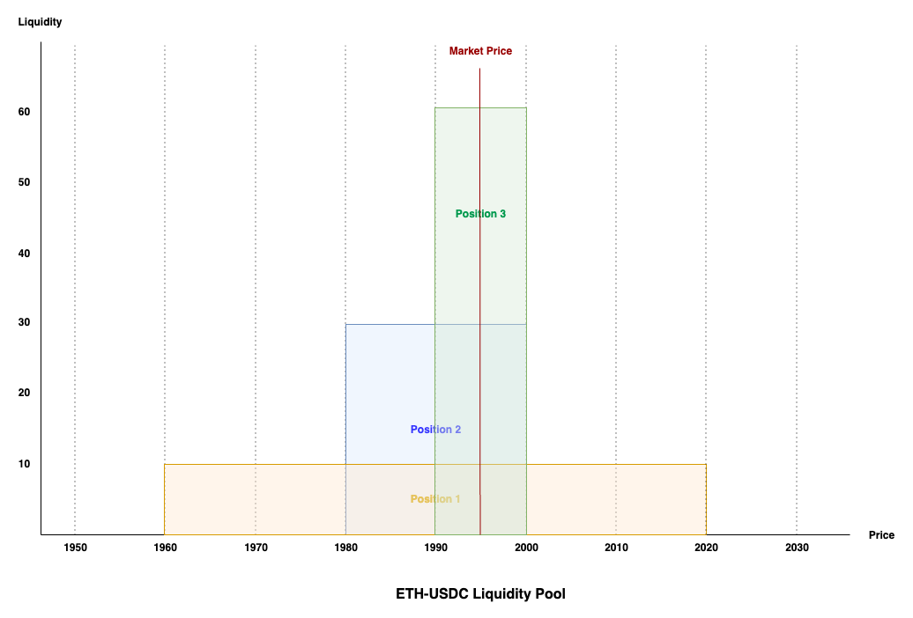

# Concentrated Liquidity

## Introduction

Concentrated liquidity enables LPs to allocate liquidity towards customized price intervals (measured as "ticks") and earn a portion of the trading fees as long as trades occur within the specified range. As such, LPs are able to determine the extent of liquidity utilization and correspondingly, the impermanent loss risks which they are willing to bear.

Concentrated liquidity is the next step in AMM advancement which enables LPs to engage in more fine-tuned liquidity provisioning strategies. To see why this is the case, it is crucial to understand how the AMM space has evolved in accordance to capital efficiency demands.

## The evolution of AMMs

### Basic price curve with infinite price range&#x20;

The basic AMM started by implementing a standard constant product curve (`x*y=k`)whereby liquidity was uniformly distributed across an infinite price range (i.e. 0 → ∞). While this supported trades across all possible price ranges, majority of the capital was left unutilized as trades for most tokens would usually be within a much narrower price range. This was especially so for more correlated pairs such as stablecoin pairs (i.e. USDC/USDT, DAI/USDC, etc.) or wrapped token pairs (i.e. wstETH/ETH, HBTC/WBTC, etc.) where price ratios rarely diverged.&#x20;

Consequently, suboptimal capital allocation resulted in greater slippage risks as there was less liquidity supporting widely traded price ranges. With fewer trades, LPs would also receive less fees while simultaneously having to bear the opportunity cost of locked but unutilized funds. The cumulative result of the above was that markets would also tend to be more volatile as limited liquidity meant that trades against smaller pools would result in significant price impacts which might kickstart a vicious cycle.

### Modified price curve with infinite price range

As all trades against an AMM takes place against the specified price curve, it was possible to improve upon the capital efficiency of the basic constant product curve by modifying the price curve equation. The most well-known variant of this approach is Curve's StableSwap which introduced a linear invariant (`x+y=C`) to the constant product curve. This effectively modified the price curve to better support trades between super-stable pairs which tended to trade very closely to a 1:1 ratio.

This price curve modification enabled trades against a balanced pool to have minimal price impact while still allowing the pool to rebalance itself through exponential price growth in times of extreme volatility. As a result of better support for stable pair swaps, more trades could be incentivized through the lowering of trading fees as the corresponding impermanent loss risks were also minimized. This worked great for super stable pairs but was not suited for token pairs which tended to trade at various price ratios for extended periods of time. Moreover, while greatly minimized, capital was still being deployed to support price extremes.

### Modified price curve with bounded price range

Keeping with the core design of the earlier version, it was discovered that liquidity could be better utilized if pools were created with a more tightly bounded price curve. For example, instead of uniformly distributing liquidity across a 0 → ∞ range, the lower and upper bound of the range should approximate the the price interval which the token pair regularly trades at. This meant that capital efficiency was greatly amplified the narrower the supported price range (i.e. a range of 0.99 → 1.01 instead of 0.9 → 1.1 is roughly 10x more capital efficient).

More liquidity supporting a narrower price range also effectively reduced slippage risks as the trade size would have to scale up according to the pool to have the same price impact. Consequently, these modified price curves worked especially well for more stable pairs where the risks of going out of range was minimal. Critically, this bounding of ranges could work hand-in-hand with price curve modifications to significantly increase capital efficiency while generalizing the applicability of this approach for all token pairs.

While this design enabled liquidity to be better utilized, it was limited in its ability to support multiple liquidity preferences as the price curve had to be fixed at the point of pool creation. This meant that LPs had to choose between adding liquidity to a specific range defined by the pool creator or else create their own pool (which also comes with significantly more gas fees). As such, depending on LP risk preferences, liquidity was likely to be fractured across different pools for the same token pair resulting in less than ideal slippage and trading volume.

### Aggregated price curve with user defined ranges

With each LP having their own liquidity preference, it only made sense that this should be reflected accordingly in the pricing curve. By enabling LPs to add liquidity to their preferred price ranges, each of these positions effectively formed their own user-defined price curve against which trades could be made against. In other words, as long as trades were occurring within the user-defined ranges, their liquidity is utilized in the market making process and hence they will earn trading fees for supporting trades within the particular "tick". Through aggregating all the different positions into a single price curve, it enabled a single pool to support the diversity of LP preferences. This was the design popularized by Uniswap v3 and has come to be known as concentrated liquidity.

<figure><figcaption>
Concentrated liquidity
</figcaption></figure>

As a consequence of this design, each LP position had to be uniquely tracked as liquidity within the pool became non-fungible (i.e. one LPs position differs from the next). This meant that LP fees could no longer be automatically reinvested into the pool at an infinite range as it had to be distributed proportionally to LPs who supported the active price range. As such, LP fees remained unutilized unless manually harvested and reinvested into the pool (which comes with additional gas fees).&#x20;

## Liquidity: Tracking LP contributions at a specific price

In order to keep track of the relative contributions of each LP towards a specific price, concentrated liquidity protocols introduces a liquidity concept. The liquidity measures the proportion of liquidity which a position contributes to each price point within the selected price range. Note that this relationship is not linear but has been simplified here for ease of understanding.

For the same total value locked (TVL), a position with a narrower range will have a higher liquidity value across the common price range. The example below illustrates this fact by running through 3 positions with varying ranges in the same pool.

<figure><figcaption>
Liquidity Concept
</figcaption></figure>

Taking an ETH-USDC pool with 3 positions with the same TVL, we can see that the proportion of tokens which each position contributes towards supporting the market price differs.&#x20;

<table data-header-hidden><thead><tr><th width="126"></th><th width="162"></th><th></th><th></th></tr></thead><tbody><tr><td>Position</td><td>TVL (USD value)</td><td>Price Range</td><td>Liquidity Contributed</td></tr><tr><td>1</td><td>6,000</td><td>1,960-2,020 (Width: 60)</td><td>10</td></tr><tr><td>2</td><td>6,000</td><td>1,980-2,000 (Width: 20)</td><td>30</td></tr><tr><td>3</td><td>6,000</td><td>1,990-2,000 (Width: 10)</td><td>60</td></tr></tbody></table>

Each of the positions above have a TVL of 6,000USD with the only difference being the specified price range. With a wider range, the liquidity is spread thinner across the selected price range. In the above example, the current market price is 1ETH:1,995USDC and hence all 3 positions are supporting the active market price. However, notice that for trades between the price range of 1,990-2,000, more of Position 3’s tokens are being utilized for the trades (i.e. 60% of the tokens being traded between 1,990-2,000 belong to Position 3). As such, it follows that each position should receive a cut of the trading fees based on the liquidity contributed towards a trade.

When plotted on the above graph, a position is represented as follows:

* The width on the position (i.e. x-axis) represents the LP's selected price range for the position. LPs will continue to earn a cut of the trading fees if their position's range supports the market price.
* The height of the position (i.e. y-axis) measures the liquidity contributed to a specific price. For each trade, the trading fees will be distributed according to the positions supporting the trade as measured by their relative liquidity values.
* The area of the position (i.e. width x height) is equivalent to the TVL of the position.&#x20;
