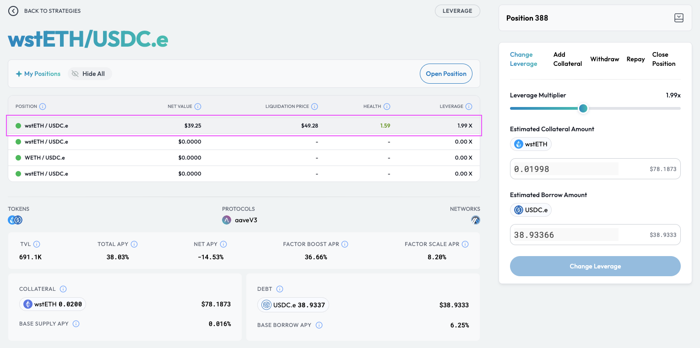

# Adjust Position Leverage

## Introduction

You can easily adjust the amount of leverage for your position via the position management dashboard. This enables you to either:

* **Increase leverage:** Gain greater exposure to the <mark style="color:green;">asset</mark> token if you believe the value of the <mark style="color:green;">asset</mark> token to <mark style="color:red;">debt</mark> token will increase.
* **Decrease leverage:** Decrease the likelihood of liquidation if you still want to maintain leveraged exposure to <mark style="color:green;">asset</mark> token but believe the value of the <mark style="color:green;">asset</mark> token to <mark style="color:red;">debt</mark> token will decrease in the short term.

With the Factor dApp,  you can adjust your position's leverage in just 2 clicks!


**Leverage Strategy Explainers**

Please refer to the [Leverage Strategy Explainer](../../../getting-started/strategy-explainers/leverage/) if you would like to understand the leverage process and how Factor streamlines the management of leveraged positions.



**Leverage Fees**

Factor charges a small transaction-based fee that supports the development of the Factor ecosystem. 50% of the protocol's ongoing revenue is [shared with veFCTR ](../../../governance/fctr-token/faq-tokenomics.md#vefctr)holders to encourage greater community governance.

The schedule of fees can be viewed [here](../../../governance/factordao/platform-fees.md#fee-structure).


## Change Your Position's Leverage

### Step 1: Navigate to the target position

You can access your position via your personalized [dashboard](https://app.factor.fi/strategies/dashboard).

<figure><figcaption>
Discover overview
</figcaption></figure>

Upon clicking the "Expand" button, you can then select the target position. Note that the following page displays all the positions created for a particular strategy.

<figure><figcaption>
Select a position
</figcaption></figure>

### Step 2: Select the new leverage amount

Once on the position management dashboard, you can then select the "Change Leverage" tab to bring up the leverage picker.&#x20;

<figure><figcaption>
Select the new leverage amount
</figcaption></figure>

The leverage slider will be loaded with the position's current leverage multiplier. By using the slider, you can adjust the position's leverage and also view the projected position metrics in real time.

### Step 3: Confirm leverage adjustment

With a new leverage multiplier selected, you can execute the changes by selecting the "Change Leverage" button. This will require a signature via the connected wallet as Factor updates the position's configurations and executes the multi-step process on the underlying protocols.

### Step 4: View new collateral amount

<figure><figcaption>
Update position metrics
</figcaption></figure>

Once the collateral addition has been executed, notice that the position's key metrics have been adjusted according to the new leverage multiplier selected:&#x20;

* **Net Value:** Minimal changes due to the incremental value of <mark style="color:red;">debt</mark> being converted to <mark style="color:green;">asset</mark>.
* **Collateral Value:** Increases by the value of the additional leverage multiplier selected multiplied by the initial <mark style="color:green;">asset</mark> provided.
* **Debt Value:** Increases by the additional value of debt required to achieve the increased leveraged multiplier.
* [**Health Factor**](../../../getting-started/glossary.md#health-factor)**:** Decreases as the collateral value decreases relative to debt value (i.e. more leveraged position).
* **Liquidation Price:** For this long position, the liquidation price increases as the position's leverage increases.
