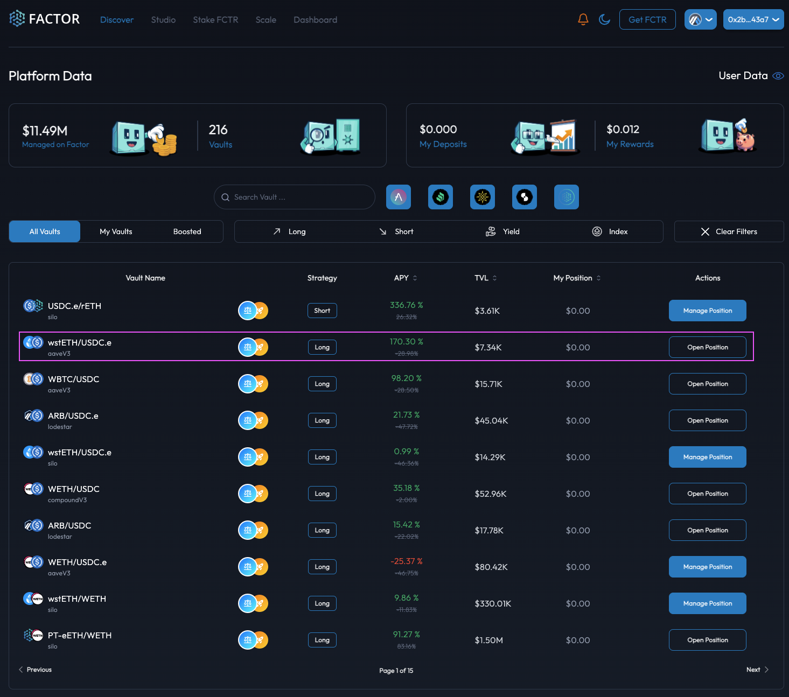
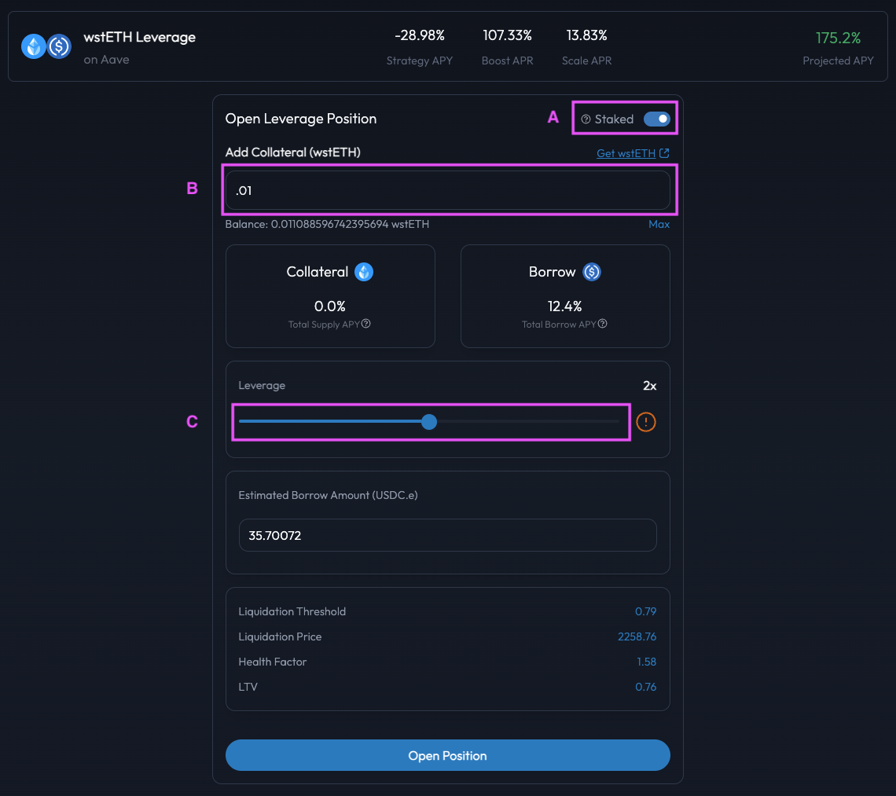
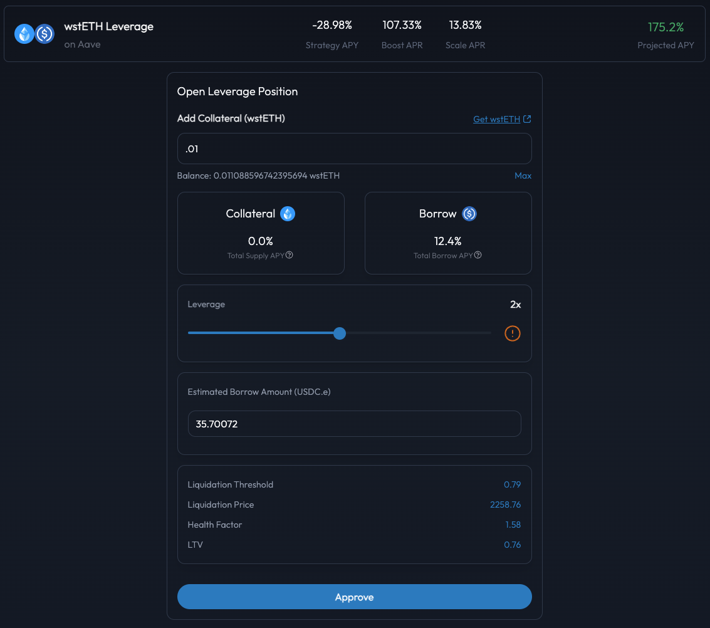
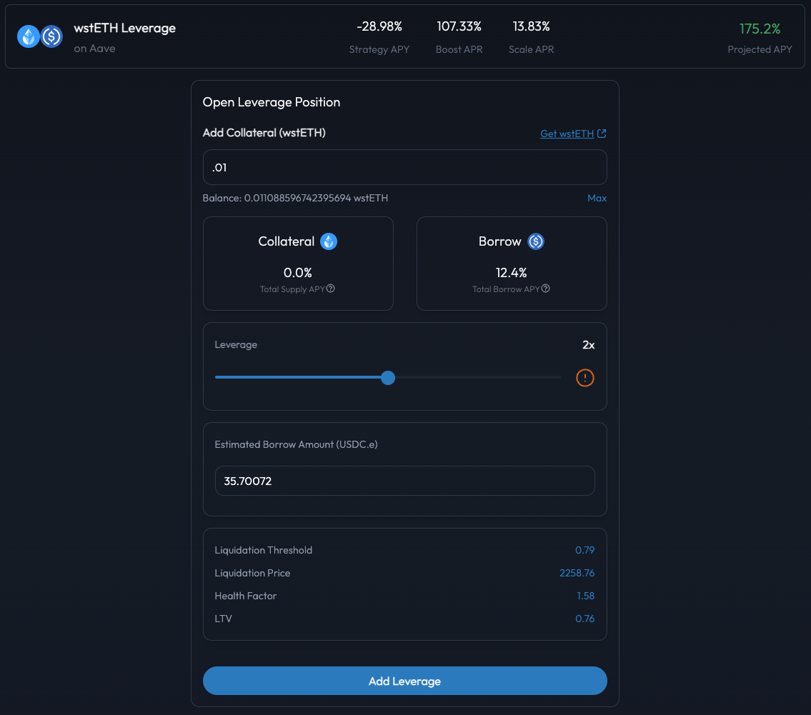
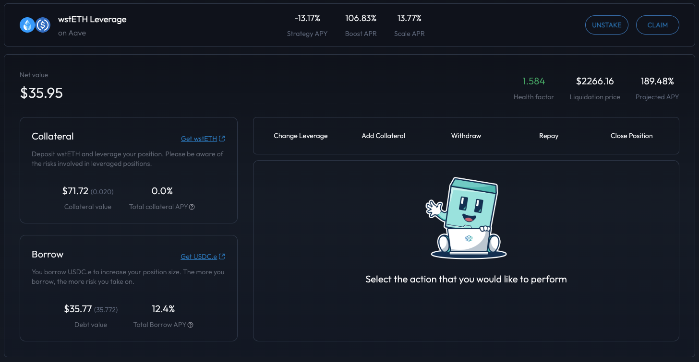

# Create A Leveraged Position

## Introduction

[Factor Studio](../../../factor-studio/factor-studio.md) enables the creation of leveraged strategies through combining multiple DeFi primitives (see Related Concepts below) into a single transaction:

1. Supply initial <mark style="color:green;">asset</mark> token to lending protocol (i.e. Silo, Aave, etc.)
2. Flash loan <mark style="color:red;">debt</mark> token from Balancer
3. Swap flash loaned <mark style="color:red;">debt</mark> token for <mark style="color:green;">asset</mark> token on OpenOcean
4. Add swapped <mark style="color:green;">asset</mark> token to lending protocol
5. Borrow <mark style="color:red;">debt</mark> token from lending protocol to repay flash loan from Balancer
6. Repay Balancer flash loan using borrowed <mark style="color:red;">debt</mark> token

By batching the generalized steps above, users get access to up to **multiple times leveraged exposure (maximum determined by underlying lending pool)** on their initial position. The flash loaned value is added to the position's collateral as <mark style="color:green;">asset</mark> token while the position incurs interest payments on the <mark style="color:red;">debt</mark> token equalling the flash loaned value.

This allows users to take either a:

* **Long position (**:ox:**):** Supply <mark style="color:green;">asset</mark> token which you believe will increase in value relative to the <mark style="color:red;">debt</mark> token thereby amplifying your exposure to any <mark style="color:green;">asset</mark> gains. For example, by taking a leveraged WETH/USDC position, the value of the debt (i.e. USDC) to the collateral (i.e. WETH) decreases if WETH increases in price relative to USDC.
* **Short position (**:bear:**):** Borrow <mark style="color:red;">debt</mark> token which you believe will decrease in value relative to the <mark style="color:green;">asset</mark> token thereby reducing your <mark style="color:red;">debt</mark> obligations. For example, by taking a leveraged USDC/WETH position, the value of the debt (i.e. WETH) to the collateral (i.e. USDC) decreases if WETH decreases in price relative to USDC.


**Leverage Strategy Explainers**

Please refer to the [Leverage Strategy Explainer](../../../getting-started/strategy-explainers/leverage/) if you would like to understand the leverage process and how Factor streamlines the management of leveraged positions.


Related Concepts

* [Collateralized Lending & Borrowing](../../../factor-building-blocks/leverage/concepts/collateralized-lending-and-borrowing.md) -> Borrowing <mark style="color:red;">debt</mark> token from lending protocols by collateralizing <mark style="color:green;">asset</mark> token.
* [Flash Loan](../../../factor-building-blocks/flash-loan/concepts/flash-loan.md) -> Uncollateralized lending that enables the creation of leverage.
* [Market Orders ](../../../factor-building-blocks/swap/concepts/market-orders.md)-> Instant swaps of tokens on Decentralized Exchanges.


**Leverage Fees**

Factor charges a small transaction-based fee that supports the development of the Factor ecosystem. 50% of the protocol's ongoing revenue is [shared with veFCTR ](../../../governance/fctr-token/faq-tokenomics.md#vefctr)holders to encourage greater community governance.

The schedule of fees can be viewed [here](../../../governance/factordao/platform-fees.md#fee-structure).


## Amplify Your DeFi Gains

### Step 1: Select A Leverage Strategy

Navigate to[ Factor Discover](https://app.factor.fi/discover) where you will be able to sort and filter through a myriad of `Long`/`Short` curated strategies. This includes lending protocols, strategy types, projected APYs, vault protocol rewards, and much more.


Take advantage of [Factor Boost](../../../governance/factor-boost/) (:rocket:) and [Factor Scale](../../../governance/factor-scale/) (:scales:) incentivized vaults to get even more profits!


<figure><figcaption>
Discover DeFi leverage strategies
</figcaption></figure>

Once you have identified your preferred strategy, select the "Open Position" button to get started on your leverage journey.

### Step 2: Create a leveraged position

By creating a position, you are configuring the leverage parameters which best suits your personal risk to reward tolerance. Factor enables you to create multiple positions per strategy whose parameters are editable.&#x20;

<figure><figcaption>
Open strategy position
</figcaption></figure>

The Factor dApp enables you to adjust the following:

* **Stake the position to earn protocol rewards (**_**A**_**):** By choosing to stake the newly created position, any liquidity held by the position will be eligible to earn protocol rewards accrued from [Factor Scale](../../../governance/factor-scale/) and [Factor Boost](../../../governance/factor-boost/).
* **Select initial collateral amount (**_**B**_**):** Specify the amount of collateral (i.e. supply/<mark style="color:green;">asset</mark> token) that will be deposited into the leverage vault. This is the amount of <mark style="color:green;">asset</mark> tokens which will be debited from your wallet to fund the leveraged position.
* **Select leverage multiplier (**_**C**_**):** Specify the amount of leverage that you are willing to take for the position. The higher the leverage, the greater the potential gains OR losses. **A 2x leverage means your leveraged position value is twice that of your initial collateral amount**.

With the above parameters configured, you can then proceed to create the position by clicking on the "Open Position" button. As your personalized position parameters will be stored on-chain, this will require a signature via your connected web3 wallet (i.e. MetaMask, etc.).

### Step 3: Approve leverage contract

With the position created, you will then need to approve a spending amount for the Factor strategy contract. This allows the strategy contract to debit the <mark style="color:green;">asset</mark> token (i.e. collateral) from your wallet for the purposes of funding the leveraged strategy. This is an on-chain transaction which requires a signature.

<figure><figcaption>
Approve Factor contract
</figcaption></figure>

### Step 4: Add liquidity to your leveraged position

Once approval has been given, you can then start to earn yields by adding liquidity to your newly created position!&#x20;

By selecting the "Add Leverage" button and signing the transaction request, Factor executes the steps outlined in the [Introduction](create-a-leveraged-position.md#introduction) that adds liquidity and therefore leverage to your newly created active position.

<figure><figcaption>
Add leverage to position 
</figcaption></figure>

### Step 5: View your active position

Factor dApp makes it easy for you to view and manage the performance of your leveraged position.

<figure><figcaption>
Position summary
</figcaption></figure>

The leverage position dashboard consists of the following metrics:

* [**Health Factor**](../../../getting-started/glossary.md#health-factor)**:** The lower the Health Factor, the higher the likelihood of liquidation with a Health Factor of 1 indicating that the position is at risk of being liquidated.
* **Liquidation Price:** The <mark style="color:green;">asset</mark> token price at which the leveraged position will be exposed to liquidation risks.&#x20;
* **Projected Yield:** The estimated percentage returns which comprising the strategy APY, [Factor Boost ](../../../governance/factor-boost/)APY, and [Factor Scale](../../../governance/factor-scale/) APY.
* **Net Value:** The USD value the position's collateral minus the position's debt.
* **Position Value:** The USD values of the <mark style="color:red;">debt</mark> amount as well as the <mark style="color:green;">asset</mark> (i.e. collateral) amount which includes the leveraged portion (i.e. flash loaned value).
* **Supply APY:** The yield generated from supplying <mark style="color:green;">asset</mark> token as collateral to the underlying lending protocol.&#x20;
* **Borrow APY:** The interest owed on the <mark style="color:red;">debt</mark> token amount which was borrowed from the underlying lending protocol.
