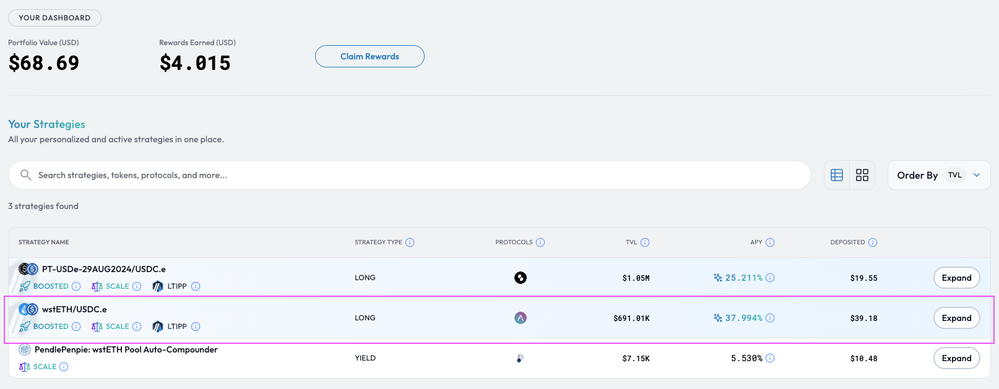
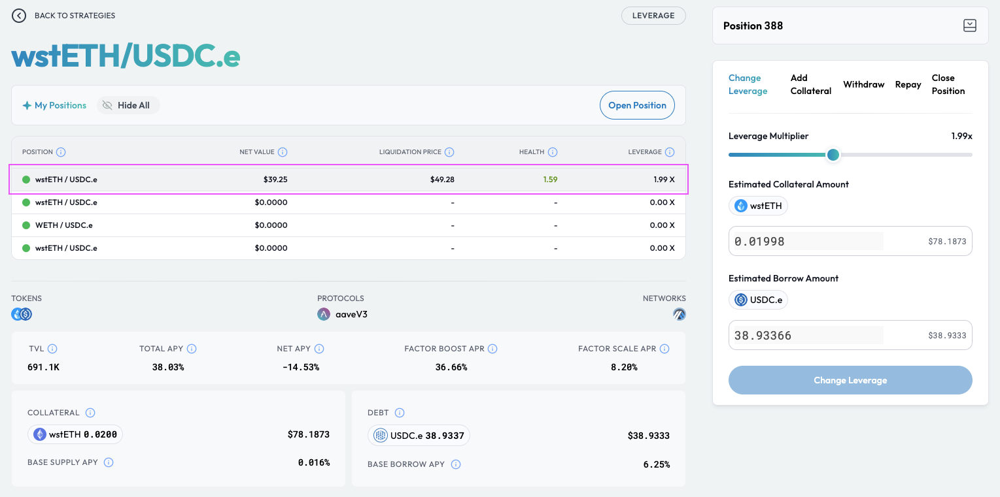
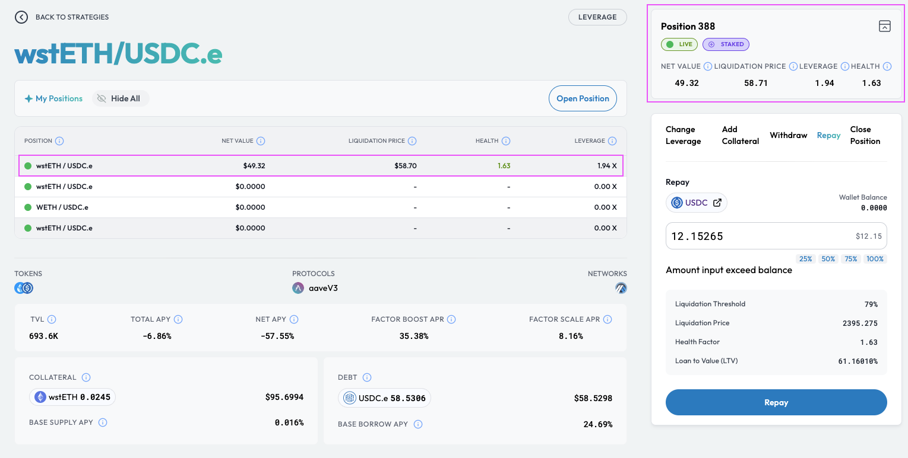

# Repay Position Debt

## Introduction

You can easily repay your position's debt via the position management dashboard. By repaying a position's debt, you are reducing the amount of debt accrued to the position and thereby reducing the risk of liquidation.


**Position Leverage Multiplier**

Note that the repayment of debt only reduces the position's debt amount. Consequently, the position's leverage multiplier is decreased accordingly with the position's [Health Factor](../../../getting-started/glossary.md#health-factor) also seeing a corresponding increase.



**Leverage Strategy Explainers**

Please refer to the [Leverage Strategy Explainer](../../../getting-started/strategy-explainers/leverage/) if you would like to understand the leverage process and how Factor streamlines the management of leveraged positions.


## Reduce Your Position's Debt


**Leverage Fees**

Factor charges a small transaction-based fee that supports the development of the Factor ecosystem. 50% of the protocol's ongoing revenue is [shared with veFCTR ](../../../governance/fctr-token/faq-tokenomics.md#vefctr)holders to encourage greater community governance.

The schedule of fees can be viewed [here](../../../governance/factordao/platform-fees.md#fee-structure).


## Reduce Your Position's Debt

### Step 1: Navigate to the target position

You can access your position via your personalized [dashboard](https://app.factor.fi/strategies/dashboard).

<figure><figcaption>
Discover overview
</figcaption></figure>

Upon clicking the "Expand" button, you can then select the target position. Note that the following page displays all the positions created for a particular strategy.

<figure><figcaption>
Select a position
</figcaption></figure>

### Step 2: Specify amount of debt to repay

Once on the position management dashboard, you can then select the "Repay" tab to specify the amount of <mark style="color:red;">debt</mark> token to be repaid.

<figure><figcaption>
Repay debt
</figcaption></figure>

### Step 3: Approve debt to be repaid

To repay your position's debt, the strategy contract will require authorization to debit the <mark style="color:red;">debt</mark> token from your wallet. You will be prompted to sign an approval request if further spending allowance is required by the strategy contract.

### Step 4: Confirm the repayment

<figure><figcaption>
Execute repayment
</figcaption></figure>

With the repayment amount selected, you can execute the changes by selecting the "Repay More" button. This will require a signature via the connected wallet as Factor updates the position's configurations and executes the multi-step process on the underlying protocols.

### Step 5: View new collateral amount

<figure><figcaption></figcaption></figure>

Once the repayment has been executed, notice that the position's key metrics have been adjusted according to the <mark style="color:red;">debt</mark> token that was repaid:

* **Net Value:** Increases by the amount of debt repaid.
* **Debt Value:** Decreases by the USD value of the <mark style="color:red;">debt</mark> tokens repaid.
* [**Health Factor**](../../../getting-started/glossary.md#health-factor)**:** Increase as the debt value decreases relative to collateral value (which is unchanged).
* **Liquidation Price:** For this long position, the liquidation price decreases as the position's leverage decreases.
* **Leverage Multiplier:** Viewable on the "Change Leverage" tab, the position's leverage decreases as the position's debt obligations are reduced.
