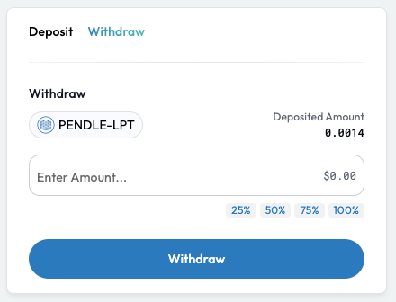
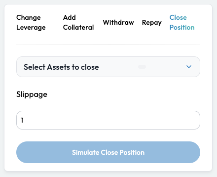
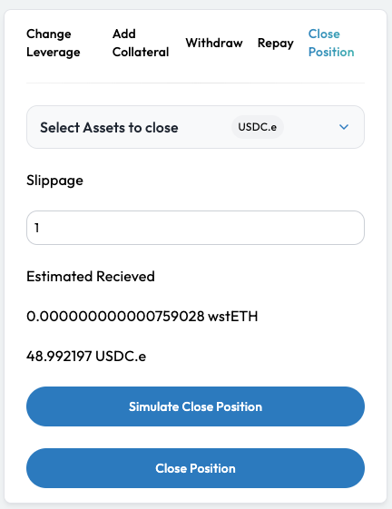

# Redeem Your PT

## Introduction

Once the PT's maturity date arrives, you can now claim your fixed rewards by converting your matured PT tokens back into the base asset at a 1:1 ratio. This means that you are finally realizing the fixed yield from holding PT as the price of the PT acquired at a discount is now equivalent to the base asset.

As matured PTs no longer generate any yields, it is recommended that you redeem your PT as soon as it matures. This will then provide you the option to either:

* Reinvest your capital into subsequent future-dated PTs
* Hold onto the yield-bearing asset and accrue more yields


**PT Strategies Explained**

Please visit our [PT Strategies Explainer](../../../getting-started/strategy-explainers/pt-strategies/) if you would like a deeper dive into PT mechanics and how best to manage your positions.


## Realizing Your PT Returns

Factor offers various strategy types that enable you to amplify your PT gains.



1. Visit the [Factor Discover](https://app.factor.fi/) page and search for your PT Yield Strategy.
2. On the strategy page, you will be able to find a withdraw option to the right of the page.\
    
3. Withdraw all your matured PT from Factor.
4. Visit the [Pendle Trade page](https://app.pendle.finance/trade/markets) and search for your PT under the "Inactive" tab.\
   &#x20;.png>)
5. You can then choose to redeem or rollover your PT to a later offering.\
   .png>)



1. Visit the [Factor Discover](https://app.factor.fi/) page and search for your PT Leverage Strategy.
2. Select the position to close and you will be able to see a "Close Position" option.\
   
3. As your PT has now matured, it is recommended that you **select the debt asset** as the token to receive when closing the position. This will save you the additional step of having to redeem your PT on Pendle.
4. Once you have selected an asset and a slippage tolerance, you can then simulate the expected output.
5. You can then proceed to claim your PT value by clicking on the "Close Position" button.\
   


