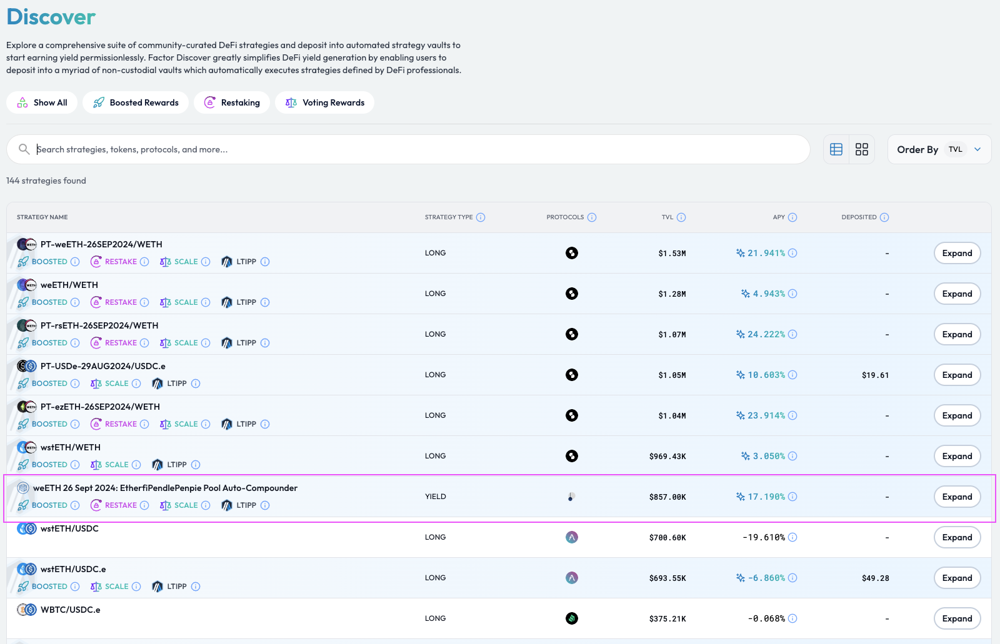
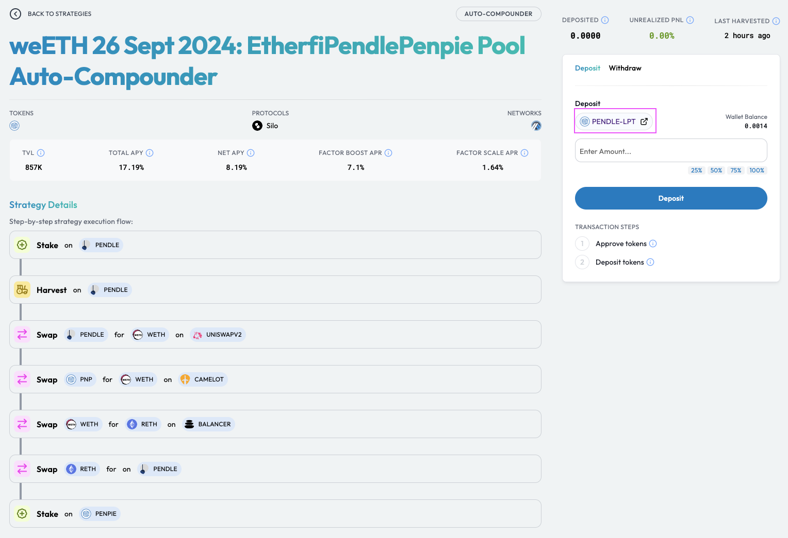
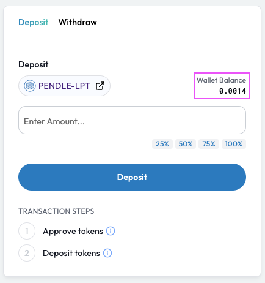
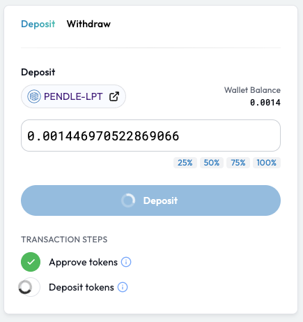
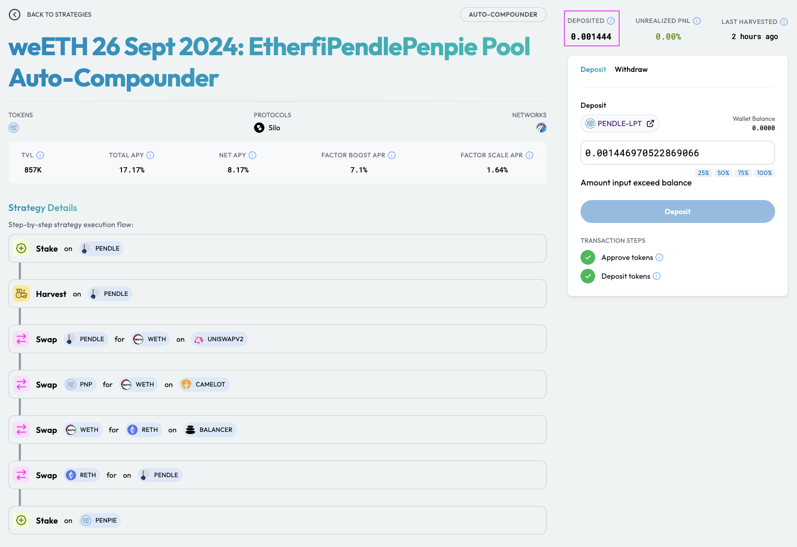

# Auto-compound Your Yields

## Introduction

[Factor Studio](../../../factor-studio/factor-studio.md) enables yield farmers to amplify their yield rewards while reducing their liquidity management overheads through automated strategy vaults. Yield farmers just need to **deposit once into a yield strategy vault and watch their yields auto-compound**. Yield strategy vaults periodically reinvests any accrued liquidity incentives through conveniently batching the following steps for each harvest event:

1. Harvest (i.e. claim) farming rewards accrued to the position
2. Swap reward tokens to pool tokens
3. Provide pool tokens as additional liquidity
4. Stake additional liquidity to earn compounded rewards

Note that a higher harvest frequency amplifies the effects of compounding while minimizing the depositor's exposure to reward tokens.


**Yield Strategy Explainers**

Please refer to the [Yield Strategy Explainer](../../../getting-started/strategy-explainers/yield/) if you would like to understand the yield auto-compounding process and how Factor streamlines the management of liquidity positions.


Related Concepts

* [Yield Farming](../../../factor-building-blocks/yield/concepts/yield-farming.md) -> Providing liquidity to protocols which provide significant liquidity incentives

## Auto-compound Your Yields

### Step 1: Select A Yield Farming Strategy

Navigate to[ Factor Discover](https://app.factor.fi/discover) where you will be able to sort and filter through a myriad of `Yield` curated strategies. This includes yield protocols, strategy types, projected APYs, vault protocol rewards, and much more.


Take advantage of [Factor Boost](../../../governance/factor-boost/) (🚀) and [Factor Scale](../../../governance/factor-scale/) (⚖️) incentivized vaults to get even more profits!


<figure><figcaption>
Discover DeFi yield strategies
</figcaption></figure>

Once you have identified your preferred strategy, select the "Deposit" button to get started on your automated yield farming journey.

### Step 2: Add liquidity to the underlying protocol

Factor yield strategies take advantage of DeFi's modularity to automate liquidity management for underlying liquidity protocols. As such, liquidity must first be deposited into the underlying protocol's contract.

<figure><figcaption>
Deposit liquidity to the relevant external protocol pool
</figcaption></figure>

The Factor dApp enables convenient access to the relevant pool via the link at the bottom right of the deposit interface. This will open the corresponding protocol dApp in a new tab whereupon you can follow the protocol specific instructions for depositing liquidity into the target pool.

Once liquidity has been successfully added into the underlying protocol, you should be able to see the LP token (i.e. token representing the protocol's liquidity) balance on the Factor interface.

<figure><figcaption>
LP token balance is updated
</figcaption></figure>

### Step 3: Approve yield strategy vault

By clicking on the "Deposit" button, you will then be required to approve a spending amount for the yield strategy contract. This enables the yield contract to debit the recently acquired LP token from your wallet so that it can manage your yield harvests. This is an on-chain transaction which requires a signature from the connected web3 wallet.

### Step 4: Deposit into the yield strategy 

Once approval has been given, you can then start to auto-compound your yields by adding liquidity to the yield strategy vault!

Following the approval, you will then be requested to sign the transaction request. Factor deposits your LP tokens into the strategy vault which then makes it eligible to be included in the next harvesting cycle (as outlined in the [Introduction](auto-compound-your-yields.md#introduction)).

<figure><figcaption>
Deposit into the yield vault
</figcaption></figure>

### Step 5: View your active position 

Upon deposit confirmation, you can view your updated yield vault balance on the Factor dApp.

<figure><figcaption>
Yield vault position balance
</figcaption></figure>
