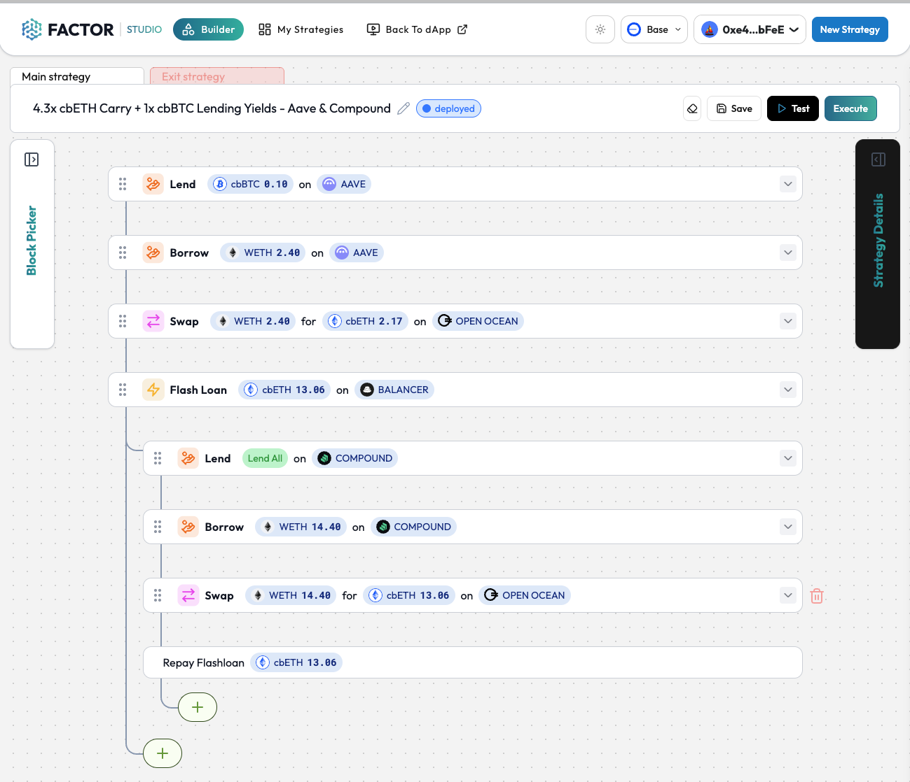

# 4.4x rETH Carry + 1x USDC Lending Yields - Aave & Compound


Visit Discover to deposit into this strategy and automate your yields!

:arrow\_right: [Strategy Link](https://pro.factor.fi/strategies/0xcf3eDe7c4Da32F19E8196E17A05Ab35cAe8AA9Ba)



Visit Studio to copy/fork and tweak this strategy!

:arrow\_right: [Strategy Builder Link](https://studio.factor.fi/?hash=0xa9a44aa3cf596db955cb9687fb373d7090411c7883fcea41384cd91f51788f99)


## Description

<figure><figcaption>
<a href="https://studio.factor.fi/?hash=0xa9a44aa3cf596db955cb9687fb373d7090411c7883fcea41384cd91f51788f99">https://studio.factor.fi/?hash=0xa9a44aa3cf596db955cb9687fb373d7090411c7883fcea41384cd91f51788f99</a>
</figcaption></figure>

This strategy earns blended USDC and ETH yields by taking advantage of differences in Aave and Compound.

By depositing USDC into Aave, this strategy earns 1x the Aave USDC lending interest. This also allows the strategy to borrow WETH against the USDC collateral with a 20% buffer.&#x20;

Borrowed WETH from Aave is swapped for rETH earning the interest differentials between rETH liquid staking yields and Aave WETH borrow interest.

The rETH is then used to create a 7x leveraged rETH:ETH position (5% liquidation buffer) which earns an additional 6x interest differential between rETH liquid staking yields and Compound WETH borrow interest. The total WETH borrowed on Compound also earns additional COMP borrow rewards.

\+ USDC supply interest (Aave)

\+ rETH liquid staking yields

\- ETH borrow interest

\+ COMP rewards on ETH borrow (Compound)

## Strategy



1. Lend $USDC - Aave
2. Borrow $ETH
   1. 62.5% deposit for 20% buffer against LTV
3. Swap borrowed $ETH → $rETH
4. Flash loan 6x the borrowed $rETH amount
   1. 5% buffer from LTV
5. Lend all $rETH - Compound
6. Borrow $ETH&#x20;
7. Swap $ETH to $rETH to cover flash loan



1. Flash loan $ETH
2. Repay $ETH debt - Compound
3. Withdraw $rETH collateral - Compound
4. Swap $rETH → $ETH
5. Repay $ETH debt - Aave
6. Withdraw $USDC collateral - Aave
7. Withdraw $USDC



## Protocol Parameters



* [\~5.11%](https://app.aave.com/reserve-overview/?underlyingAsset=0xaf88d065e77c8cc2239327c5edb3a432268e5831\&marketName=proto_arbitrum_v3) USDC Supply Interest
* [\~2.33%](https://app.aave.com/reserve-overview/?underlyingAsset=0x82af49447d8a07e3bd95bd0d56f35241523fbab1\&marketName=proto_arbitrum_v3) WETH Borrow Interest
* [75%](https://app.aave.com/reserve-overview/?underlyingAsset=0xaf88d065e77c8cc2239327c5edb3a432268e5831\&marketName=proto_arbitrum_v3) USDC Max LTV



* [\~2.1%](https://app.compound.finance/markets/weth-arb) WETH Borrow
* [\~0.64%](https://app.compound.finance/markets/weth-arb) COMP Borrow Rewards



* [\~2.64%](https://rocketpool.net/) rETH Liquid Staking Yields



* 0.1% Max Slippage Config



## Strategy Performance Conditions



* rETH continuously increases in value vs WETH.
* WETH borrow cost is less than rETH liquid staking yields across Aave and Compound (including COMP rewards).
* USDC supply interest is greater than the interest differentials between rETH yield and WETH borrow.



* rETH depegs from ETH.
* rETH liquid staking yields falls below WETH borrow costs.



## Calculation Template


**Create Your Own Strategies!**

Create a copy of the sheet below and tweak it to create your own personalized strategy.



[https://docs.google.com/spreadsheets/d/1BfH0bezfJQkeAvkuedWoZZbPKsj6rvkPNLOgIipJDlU/edit?usp=sharing](https://docs.google.com/spreadsheets/d/1BfH0bezfJQkeAvkuedWoZZbPKsj6rvkPNLOgIipJDlU/edit?usp=sharing)


## Estimated Returns


[https://docs.google.com/spreadsheets/d/1pdPqohiBsrAQZJx\_EKAlvZbzZ8PYlClEIxsk3D71ovE/edit?usp=sharing](https://docs.google.com/spreadsheets/d/1pdPqohiBsrAQZJx_EKAlvZbzZ8PYlClEIxsk3D71ovE/edit?usp=sharing)

