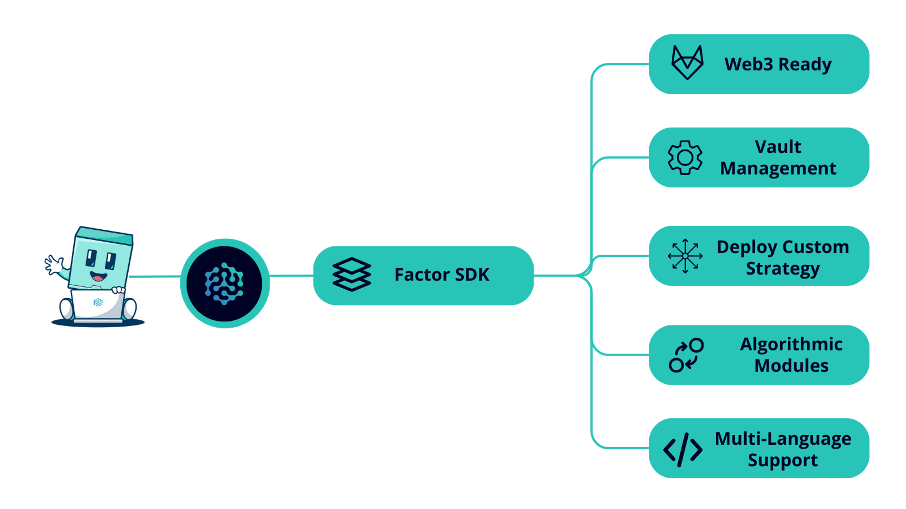

# 📦 Factor SDK

## Overview

Factor's SDK is a versatile toolkit for easier use of the Factor platform. It helps users develop and deploy custom strategies effortlessly. The SDK has many features and supports multiple programming languages, enabling users to turn unique insights into personalized trading strategies.

<figure><figcaption></figcaption></figure>


:construction: The Factor SDK is currently under construction. Stay tuned for exciting updates coming real soon!


#### What Does The SDK offer?

The Factor SDK is a comprehensive toolset packed with features to assist you in the entire journey of developing, deploying, and managing custom trading strategies on the Factor platform. Its user-friendly interface and seamless integration simplify the complexities of crafting bespoke strategies, enabling users to concentrate on their distinctive insights and trading objectives.

* **Connectivity**: Initializes a connection with MetaMask using the SDK and relies on the injected web3 provider and signer for interactions.
* **Smart contract Interactions**: Facilitates interaction with smart contracts for creating and managing strategies and projects on the Factor platform.
* **Fetch Data**: Leverages the SDK to fetch settings, underlying assets, total value locked (TVL), and performance fees for specific strategies or projects.
* **Strategy Factory**: Utilizes the SDK to allow users to deploy custom strategies and interact with them.
* **Algorithm Modules:** Users have access to algorithmic modules for customizing rebalancing and execution algorithms. Examples include Time-Weighted Average Price (TWAP) and Iceberg templates to efficiently mitigate slippage.
* **Deposit & Withdrawal**: Simplifies deposit and withdraw processes using the SDK.
* **Multi-language Support**: Offers an API for writing strategies in Python, R, Pinescript, and other programming languages, making the SDK versatile and adaptable to various user needs.

The Factor SDK is a comprehensive toolset packed with features to assist you in the entire journey of developing, deploying, and managing custom trading strategies on the Factor platform. Its user-friendly interface and seamless integration simplify the complexities of crafting bespoke strategies, enabling users to concentrate on their distinctive insights and trading objectives.

* **Connectivity**: Initializes a connection with MetaMask using the SDK and relies on the injected web3 provider and signer for interactions.
* **Smart contract Interactions**: Facilitates interaction with smart contracts for creating and managing strategies and projects on the Factor platform.
* **Fetch Data**: Leverages the SDK to fetch settings, underlying assets, total value locked (TVL), and performance fees for specific strategies or projects.
* **Strategy Factory**: Utilizes the SDK to allow users to deploy custom strategies and interact with them.
* **Algorithm Modules:** Users have access to algorithmic modules for customizing rebalancing and execution algorithms. Examples include Time-Weighted Average Price (TWAP) and Iceberg templates to efficiently mitigate slippage.
* **Deposit & Withdrawal**: Simplifies deposit and withdraw processes using the SDK.
* **Multi-language Support**: Offers an API for writing strategies in Python, R, Pinescript, and other programming languages, making the SDK versatile and adaptable to various user needs.
