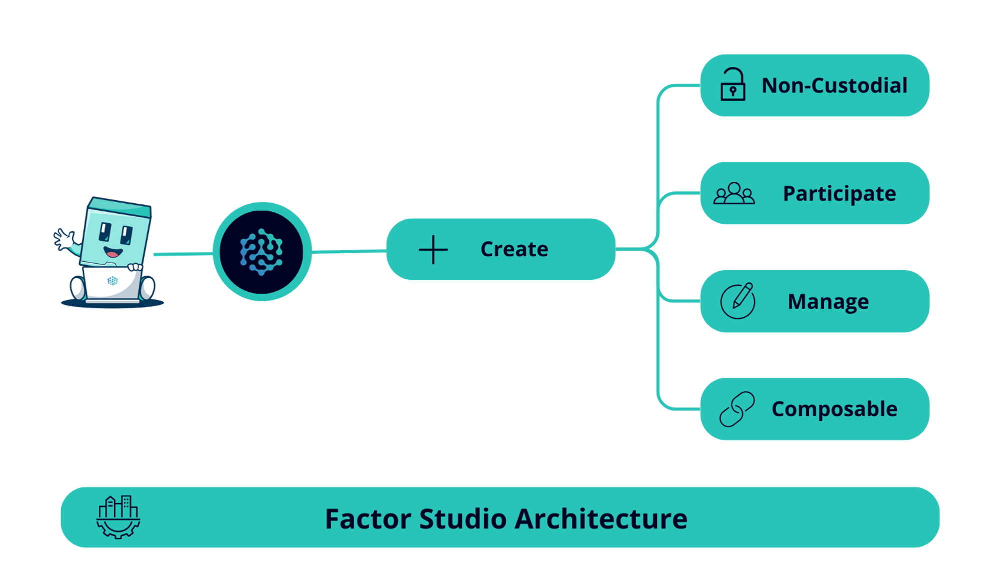

# 🎨 Factor Studio

## Overview

<figure><figcaption></figcaption></figure>

Factor Studio is making DeFi accessible to all by reimagining how DeFi strategies can be created and shared. As Factor’s flagship product, Factor Studio embodies our mission to democratize access to open and pemissionless rails through user-centric design. Finding and creating DeFi strategies with a real edge is already hard enough hence Factor Studio was crafted to make the journey to financial autonomy easier.

* [**Private Strategies**](../studio/)**:** Combine varying strategies across multiple DeFi protocols into one automated strategy with ease.
* [**Public Strategies**](../studio-pro/)**:** Shorten your time to market for building managed strategies and start earning fees through user deposits on [Factor Discover](../../factor-discover/factor-discover/).

Built on the premise of flexible [building blocks](/broken/pages/qNiXKjtPcqNVNXaG59w6), Factor Studio functions as DeFi’s composability layer enabling cross-protocol strategies to be seamlessly integrated and automated. By abstracting implementation and operational complexities, Factor Studio enable DeFi strategies to be quickly iterated upon with no coding knowledge required. These strategies can then be shared resulting in a thriving community where anyone can participate.

<figure><figcaption></figcaption></figure>

Factor Studio is a one-stop platform for creating Accessible, Composable, and Efficient DeFi strategies.

## Features

* **A Journey For Every User:** Whether you’re a beginner or a certified Degen, Factor Studio streamlines your DeFi journey through strategy automations and user-friendly interfaces (dapps or SDK).
* **Strategies Not Code:** Factor Studio comes packaged with the [Strategy Builder](../strategy-builder/) enabling the creation of complex DeFi strategies via mix-and-matching [Factor Building Blocks](../../factor-building-blocks/factor-building-blocks.md). Focus on building strategies and not on code implementations.
* **One Platform, All Of DeFi:** Mix-and-match intricate strategies across multiple DeFi protocols on a single platform. [Factor Adapters](../../factor-adapters/factor-adapters.md) provides protocol abstractions that ensures seamless interoperability while being secure and permissionless.
* **Shorten Your Time To Market:** Leverage Factor Studio’s multiple automation tools and strategy templates to get your strategy up and earning in no time. Shorter iteration times not only lowers your overheads but also enables you to find better product market fit.
* **Inherited Security:** All of Factor Studio's factory contracts have been audited and undergoes consistent monitoring thereby ensuring your personalized strategy contracts are safe.
* **Native Governance Integration:** Strategies created via Factor Studio are seamlessly integrated with Factor governance contracts allowing you and your depositors to benefit from FactorDAO rewards.

## Integrations


**Supported Protocols**

Factor Studio has integrated with multiple leading DeFi protocols, offering a broad spectrum of possibilities for your strategies.

Please refer to [Supported Protocols](../../getting-started/supported-protocols.md) to view the full list of integrations across the various DeFi segments.

