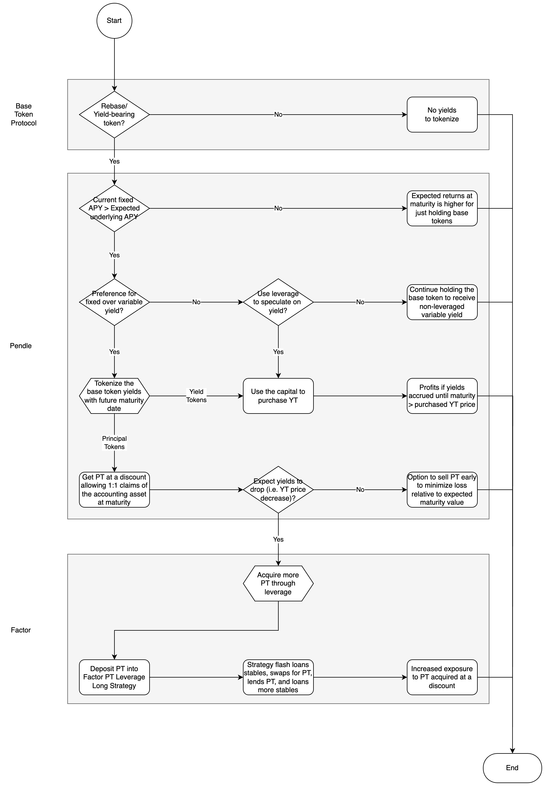

# Leverage User Guides

## Overview

This section is meant to guide you along your DeFi leverage journey from helping you ask the right questions to how to open a leveraged position on the [Factor dapp](https://app.factor.fi/discover).


**Leverage Strategy Explainer**

Please refer to the [Leverage Strategy Explainer](../../../getting-started/strategy-explainers/leverage.md) if you would like to intuitively understand how Factor combines multiple DeFi primitives into a single transaction to enable streamlined management of leveraged positions.


## Choosing The Right Strategy

The decision flow below guides you through the key considerations when determining whether a leverage strategy is suitable for your specific goals and expectations.&#x20;



<figure><figcaption>
Standard leverage strategy
</figcaption></figure>

#### Key Considerations

* **Expected Token Price Direction:** If you believe the token price will go up, open a **Leveraged Long** position to amplify gains from the price increases. Alternatively, if you believe the token price will go down, open a **Short Leveraged** position to profit from market downturns.
* **Borrowing Costs:** When supplying and borrowing tokens from lending protocols, take note of the borrowing costs. If Supply APY is greater than Borrow APY, you get even more yields for lending out your token. Alternatively, if Borrow APY is greater than Supply APY, there is a borrowing cost attached to the loan and this has to be compared to the expected leveraged strategy returns.
* **Lending Overhead:** Leveraged positions requires monitoring as they are susceptible to liquidation if the position becomes undercollateralized. Factor dapp displays your position's [Health Factor](../../../getting-started/glossary.md#health-factor) which enables easy management of your leverage position. While liquidation risks are low as long as a reasonable leverage multiplier is selected, we understand that this introduces another consideration and would recommend depositor's to explore pure lending strategies (on our partner dapps) if they would still like to generate yield without liquidation risks.



<figure><figcaption>
PT leverage strategy
</figcaption></figure>

#### Key Considerations

* **Base Asset Yield:** Only tokens which are yield-bearing or have a rebase mechanism can be utilized on Pendle. This is because Pendle splits the fixed income and variable yields portion of such tokens. Note that yield tokens can continue to be traded on the open market hence allowing users to enter or exit positions depending on market conditions.
* **PT Leverage Long Strategies:** As the base asset for PT-TKN accrues yield relative to the base asset, only leverage long strategies are profitable. That is, the value of your collateral (PT-TKN) approaches debt value (stable/base asset) at maturity resulting in a lower debt ratio. This also means **minimal liquidation risks**.
* **Fixed Yields:** By exchanging TKN for PT-TKN on Pendle, you are effectively locking in the fixed yields if you hold the PT-TKN to maturity. In effect, you are selling all base token variable yields (i.e. YT-TKN) until maturity in exchange for a fixed yield at maturity. In short, holding PT means you are shorting yield (i.e. expect yields to drop).
* **Variable Yields:** If you believe that the base token yields will increase, you can instead choose to buy YT representing the base token variable yield on Pendle. In order to turn a profit, all yield accrued until maturity must be more than the YT price when bought. You can effectively amplify your yield exposure by using the same capital amount to purchase more YT (as the yield portion of a token is generally much smaller than the principal).
* **Leveraging PT:** The APY from holding discounted PT tokens to maturity is realized at the point when the PT tokens were acquired via Pendle. As such, the timing of when you enter the market (i.e. add leverage to your position) determines the actual position returns.
* **Borrowing Costs:** When supplying and borrowing tokens from lending protocols, take note of the borrowing costs. If Supply APY is greater than Borrow APY, you get even more yields for lending out your token. Alternatively, if Borrow APY is greater than Supply APY, there is a borrowing cost attached to the loan and this has to be compared to the expected leveraged strategy returns.




**Strategy Simulations**

The interactive sheets below are meant help you gain an intuition of the potential strategy returns. Choose your tokens, add your strategy parameters, and see how Factor leverage strategies simplifies your DeFi journey.

* [Leverage Long](https://docs.google.com/spreadsheets/d/19vwuheFm9lSNzmXJDw7D9VjB9jf4MyBvPeGcDxPzkw0/edit?usp=sharing)
* [Pendle Leverage Long](https://docs.google.com/spreadsheets/d/1EzPB9GwADL1NBvRRC-xdisb4Z6WdfUZAQmhxEjIyaP0/edit?usp=sharing)


## Guides

The user guides below provides a step-by-step walkthrough of how to create and manage a leveraged position on the [Factor dApp](https://app.factor.fi/).&#x20;

<table data-view="cards"><thead><tr><th></th><th data-hidden></th><th data-hidden></th><th data-hidden data-card-target data-type="content-ref"></th></tr></thead><tbody><tr><td><a href="create-a-leveraged-position.md"><strong>Create A Leveraged Position</strong></a></td><td></td><td></td><td><a href="create-a-leveraged-position.md">create-a-leveraged-position.md</a></td></tr><tr><td><a href="adjust-position-leverage.md"><strong>Adjust Position Leverage</strong></a></td><td></td><td></td><td><a href="adjust-position-leverage.md">adjust-position-leverage.md</a></td></tr><tr><td><a href="add-collateral-to-position.md"><strong>Add Collateral To Position</strong></a></td><td></td><td></td><td><a href="add-collateral-to-position.md">add-collateral-to-position.md</a></td></tr><tr><td><a href="withdraw-collateral-from-position.md"><strong>Withdraw Collateral From Position</strong></a></td><td></td><td></td><td><a href="withdraw-collateral-from-position.md">withdraw-collateral-from-position.md</a></td></tr><tr><td><a href="repay-position-debt.md"><strong>Repay Position Debt</strong></a></td><td></td><td></td><td><a href="repay-position-debt.md">repay-position-debt.md</a></td></tr></tbody></table>
