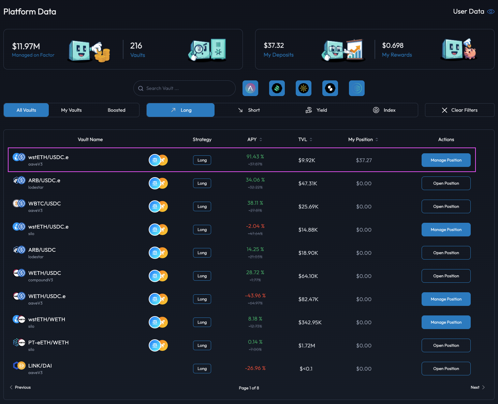
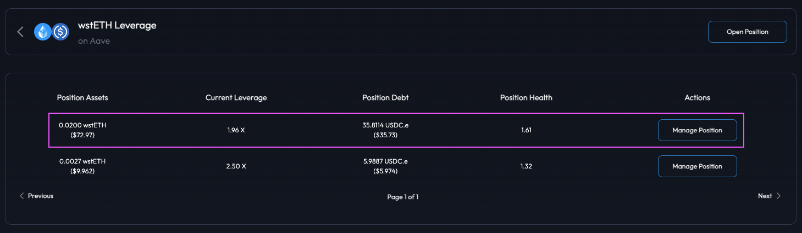
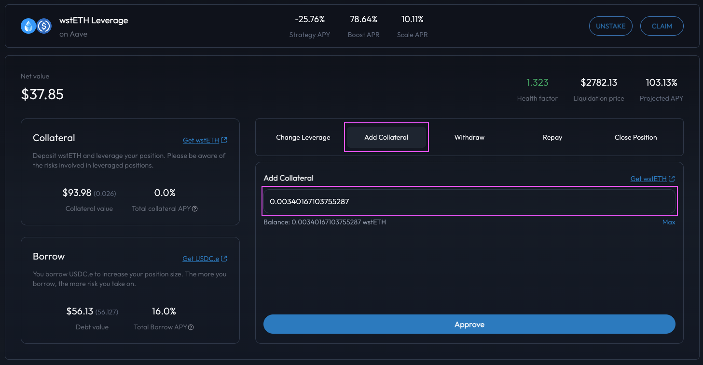
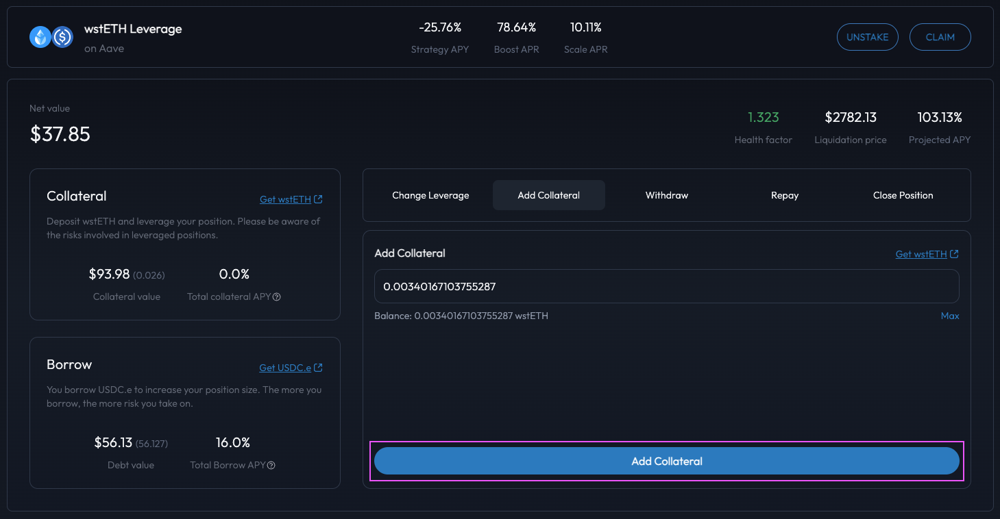
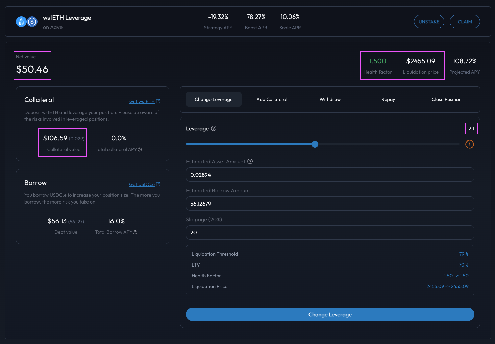

# Add Collateral To Position

## Introduction

You can easily add collateral to your leveraged position via the position management dashboard. By adding more collateral to the position, you are ensuring that the position does not become undercollateralized and therefore reduces the position's liquidation risks.&#x20;


**Position Leverage Multiplier**

Note that the adding of collateral only increases the position's collateral amount. Consequently, the position's leverage multiplier is reduced accordingly with the position's [Health Factor](../../../getting-started/glossary.md#health-factor) also seeing a corresponding increase.


## Increase Your Position's Collateral

### Step 1: Navigate to the target position

You can access your position via the [Factor Discover](https://app.factor.fi/discover) overview. For easier access, you can also filter the page by the "My Vaults" quick filter to view your active positions.

<figure><figcaption>
Discover overview
</figcaption></figure>

Upon clicking the "Manage Position" button, you can then select the target position. Note that the following page displays all the positions created for a particular strategy.

<figure><figcaption>
Select a position
</figcaption></figure>

### Step 2: Select the amount of collateral to add

Once on the position management dashboard, you can then select the "Add Collateral" tab specify the additional amount of <mark style="color:green;">asset</mark> token to be added to the position.

<figure><figcaption>
Input the amount of additional collateral
</figcaption></figure>

### Step 3: Approve additional collateral amount

To add additional collateral to the position, the strategy contract will require authorization to debit the <mark style="color:green;">asset</mark> token from your wallet. You will be prompted to sign an approval request if further spending allowance is required by the strategy contract.

### Step 4: Confirm the collateral addition

With an additional collateral amount selected, you can execute the changes by selecting the "Add Collateral" button. This will require a signature via the connected wallet as Factor updates the position's configurations and executes the multi-step process on the underlying protocols.

<figure><figcaption>
Add collateral to the position
</figcaption></figure>

### Step 5: View new collateral amount

<figure><figcaption>
Updated position metrics
</figcaption></figure>

Once the collateral addition has been executed, notice that the position's key metrics have been adjusted according to the additional <mark style="color:green;">asset</mark> token added as collateral.

* **Net Value:** Increases by the USD value of the additional collateral.
* **Collateral Value:** Increases by the USD value of the additional collateral.
* [**Health Factor**](../../../getting-started/glossary.md#health-factor)**:** Increases as the collateral value increases relative to debt value (which is unchanged).
* **Liquidation Price:** For this long position, the liquidation price decreases as the position's leverage decreases.
* **Leverage Multiplier:** Viewable on the "Change Leverage" tab, the position's leverage decreases as there are more <mark style="color:green;">asset</mark> tokens collateralizing the same amount of debt.
