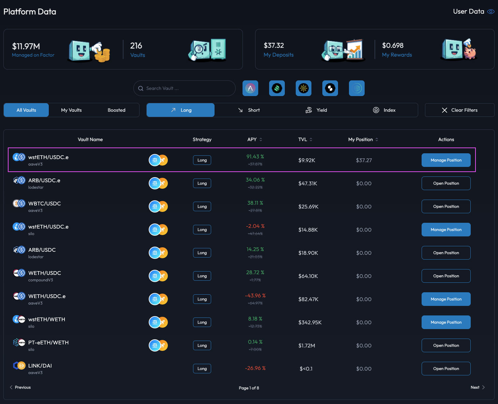

# Withdraw Collateral From Position

## Introduction

You can easily remove collateral from your leveraged position via the position management dashboard. By removing collateral from the position, you are effectively reducing the value of the collateral backing the current position's debt. As such, collateral withdrawals should be handled with care so as to avoid unexpected liquidations due to undercollateralization of the leveraged position.


**Position Leverage Multiplier**

Note that the removal of collateral only reduces the position's collateral amount. Consequently, the position's leverage multiplier is increased accordingly with the position's [Health Factor](../../../getting-started/glossary.md#health-factor) also seeing a corresponding decrease.



**Leverage Strategy Explainers**

Please refer to the [Leverage Strategy Explainer](../../../getting-started/strategy-explainers/leverage.md) if you would like to understand the leverage process and how Factor streamlines the management of leveraged positions.


## Remove Collateral Backing Your Position


**Leverage Fees**

Factor charges a small transaction-based fee that supports the development of the Factor ecosystem. 50% of the protocol's ongoing revenue is [shared with veFCTR ](../../../governance/fctr-token/faq-tokenomics.md#vefctr)holders to encourage greater community governance.

The schedule of fees can be viewed [here](../../../governance/factordao/platform-fees.md#fee-structure).


## Remove Collateral Backing Your Position

### Step 1: Navigate to the target position

You can access your position via the [Factor Discover](https://app.factor.fi/discover) overview. For easier access, you can also filter the page by the "My Vaults" quick filter to view your active positions.

<figure><figcaption>
Discover overview
</figcaption></figure>

Upon clicking the "Manage Position" button, you can then select the target position. Note that the following page displays all the positions created for a particular strategy.

<figure><figcaption>
Select a position
</figcaption></figure>

### Step 2: Select the amount of collateral to remove

Once on the position management dashboard, you can then select the "Withdraw" tab to specify the amount of <mark style="color:green;">asset</mark> token to be removed from the position.

<figure><figcaption>
Withdraw collateral
</figcaption></figure>


**Max Safe Withdraw**

The Factor dApp provides an estimated maximum safe withdrawal amount which ensures that the leveraged position does not become undercollateralized upon removal of <mark style="color:green;">asset</mark> token.

As markets for the token pair can be volatile, please consider adding in some buffer when withdrawing collateral to reduce liquidation risks.


### Step 3: Confirm the collateral withdrawal

With the collateral withdrawal amount selected, you can execute the changes by selecting the "Withdraw" button. This will require a signature via the connected wallet as Factor updates the position's configurations and executes the multi-step process on the underlying protocols.

### Step 4: View new collateral amount

<figure><figcaption></figcaption></figure>

Once the collateral withdrawal has been executed, notice that the position's key metrics have been adjusted according to the <mark style="color:green;">asset</mark> token amount that was removed.

* **Net Value:** Decreases by the USD value of the collateral removed.
* **Collateral Value:** Decreases by the USD value of the collateral removed.
* [**Health Factor**](../../../getting-started/glossary.md#health-factor)**:** Decreases as the collateral value decreases relative to debt value (which is unchanged).
* **Liquidation Price:** For this long position, the liquidation price increases as the position's leverage increases.
* **Leverage Multiplier:** Viewable on the "Change Leverage" tab, the position's leverage increases as there are less <mark style="color:green;">asset</mark> tokens collateralizing the same amount of debt.
