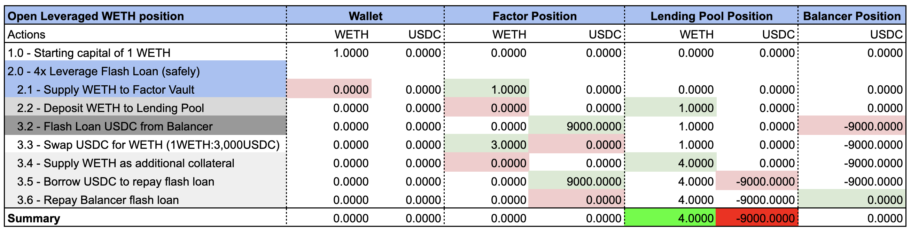
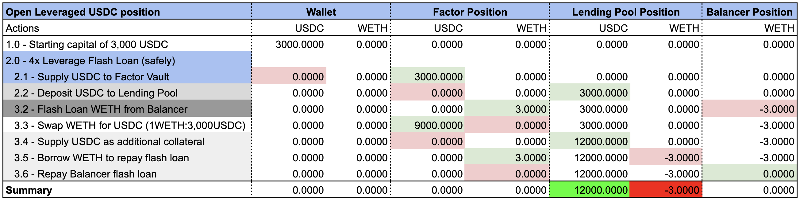

# Leverage

## Overview

The Factor leverage strategy enables users to benefit from the differences between the cost of borrowing and the expected profit generated from the borrowed liquidity. Put simply, one-click on the Factor dApp enables you to **access multiple times your initial capital value** (the maximum leverage is determined by the underlying lending pool). Leveraged positions opens a borrow position against your collateralized assets to enable access to further liquidity.

[Factor Studio](https://docs.factor.fi/factor-studio/factor-studio) combines multiple DeFi primitives into a single leverage transaction to enable the creation of leverage on DeFi positions:

1. Supply initial <mark style="color:green;">asset</mark> token to lending protocol (i.e. Silo, Aave, etc.)
2. Flash loan <mark style="color:red;">debt</mark> token from Balancer
3. Swap flash loaned <mark style="color:red;">debt</mark> token for <mark style="color:green;">asset</mark> token on OpenOcean
4. Add swapped <mark style="color:green;">asset</mark> token to lending protocol
5. Borrow <mark style="color:red;">debt</mark> token from lending protocol to repay flash loan from Balancer
6. Repay Balancer flash loan using borrowed <mark style="color:red;">debt</mark> token

Note that the flash loaned value is added to the position's collateral as <mark style="color:green;">asset</mark> token while the position incurs interest payments on the <mark style="color:red;">debt</mark> token equalling the flash loaned value.&#x20;


**Liquidation Thresholds**

Lending protocols each define their own [collateralization ratio](../glossary.md#collateralisation-ratio) that dictates the maximum value of debt tokens that can be borrowed relative to the value of the collateralized asset tokens.

While this ensures the solvency of the protocol, this means that leveraged positions are liable to being liquidated once it becomes undercollateralized. The Factor dApp enables you to track key liquidation threshold metrics such as the position's [Health Factor ](../glossary.md#health-factor)as well as the projected [Liquidation Price](../glossary.md#liquidation-price).&#x20;

As crypto markets can be volatile, please pay particular attention to the liquidation thresholds and provide additional buffers to keep your funds safe.


Related Concepts

* [Collateralized Lending & Borrowing](../../factor-building-blocks/leverage/concepts/collateralized-lending-and-borrowing.md) -> Borrowing <mark style="color:red;">debt</mark> token from lending protocols by collateralizing <mark style="color:green;">asset</mark> token.
* [Flash Loan](../../factor-building-blocks/flash-loan/concepts/flash-loan.md) -> Uncollateralized lending that enables the creation of leverage.
* [Market Orders ](../../factor-building-blocks/swap/concepts/market-orders.md)-> Instant swaps of tokens on Decentralized Exchanges.


**Strategy Simulations**

The interactive sheets below are meant help you gain an intuition of the potential strategy returns. Choose your tokens, add your strategy parameters, and see how Factor leverage strategies simplifies your DeFi journey.

* [Pendle Leverage Long](https://docs.google.com/spreadsheets/d/1EzPB9GwADL1NBvRRC-xdisb4Z6WdfUZAQmhxEjIyaP0/edit?usp=sharing)


## What This Means

By depositing into Factor leverage vaults, you can amplify your potential returns by taking either a:

* **Long position (**:ox:**):** Supply <mark style="color:green;">asset</mark> token which you believe will increase in value relative to the <mark style="color:red;">debt</mark> token thereby amplifying your exposure to any <mark style="color:green;">asset</mark> gains. For example, by taking a leveraged WETH/USDC position, the value of the debt (i.e. USDC) to the collateral (i.e. WETH) decreases if WETH increases in price relative to USDC.
* **Short position (**:bear:**):** Borrow <mark style="color:red;">debt</mark> token which you believe will decrease in value relative to the <mark style="color:green;">asset</mark> token thereby reducing your <mark style="color:red;">debt</mark> obligations. For example, by taking a leveraged USDC/WETH position, the value of the debt (i.e. WETH) to the collateral (i.e. USDC) decreases if WETH decreases in price relative to USDC.


**Get Started With Leverage Strategies!**

You can visit our [Leverage User Guides](../../factor-studio/studio-discover/leverage-user-guides/) if you would like to get started with leverage strategies.


## Examples



### **Strategy Parameters**

* Asset token: WETH
* Debt token: USDC
* Price ratio: 1WETH:3,000USDC
* Leverage vault: WETH/USDC

### **Position Parameters**

* Leverage multiplier: 4

### **Deposit Parameters**

* Initial capital: 1WETH

### Strategy Execution

<figure><figcaption>
Leverage WETH long
</figcaption></figure>

### Strategy Results

* WETH exposure -> $$4\text{WETH}\times{\text{supplyAPY}}$$
* USDC debt obligation -> $$9000\text{USDC}\times{\text{borrowAPY}}$$

### Profit Condition

Assuming the difference between $$supplyAPY$$ and $$borrowAPY$$ is negligible, the position earns 4x the profit for every increment in WETH price.

If WETH price increases 1% to 1WETH:3,030USDC, the position's collateral of 4WETH is now worth 12,120USDC. By choosing to close the position and repay the loans (i.e. 9,000USDC), the depositor is left with the initial capital of 1WETH and a profit of 120USDC. This equates to a 4x profit based on the depositor's initial outlay (i.e. every 1% gain in WETH is multiplied by the leverage multiplier).

### Leverage Risks

The leverage multiplier also works in the opposite direction if the WETH prices drop. This means that the higher the leverage multiplier, the higher the risks of liquidation as the debt value remains the same while the position's collateral value drops significantly.

For example, a 1% drop in WETH price to 1WETH:2,070USDC results in the position's collateral of 4WETH being valued at 11,880USDC. Upon paying back the 9,000USDC debt, the depositor is only able to retrieve 0.96ETH (i.e. a 4% loss).&#x20;

Notice that for the collateral to always cover the debt obligations, WETH can only drop a maximum of 25% before the position becomes undercollateralized and therefore liable to forced liquidations.



### **Strategy Parameters**

* Asset token: USDC
* Debt token: WETH
* Price ratio: 1WETH:3,000USDC
* Leverage vault: USDC/WETH

### **Position Parameters**

* Leverage multiplier: 4

### **Deposit Parameters**

* Initial capital: 3,000USDC

### Strategy Execution

<figure><figcaption>
Leverage WETH long
</figcaption></figure>

### Strategy Results

* USDC exposure -> $$12000\text{USDC}\times{\text{supplyAPY}}$$
* WETH debt obligation -> $$3\text{WETH}\times{\text{borrowAPY}}$$

### Profit Condition

Assuming the difference between $$supplyAPY$$ and $$borrowAPY$$ is negligible, the position realizes a 4x profit for every decrement in WETH price.

If WETH price drops 1% to 1WETH:2,070USDC, the 3WETH debt obligation remains the same as it is denominated in WETH. To close the position, the depositor can then:

1. Flash loan outstanding 3WETH debt
2. Repay lending pool 3WETH debt
3. Retrieve 12,000USDC collateral
4. Swap 11,880USDC to 3WETH&#x20;
5. Repay 3WETH flash loan
6. Profit 120USDC

This equates to a 4x profit based on the depositor's initial outlay (i.e. every 1% drop in WETH is multiplied by the leverage multiplier and realized as USDC gains).

### Leverage Risks

The leverage multiplier also works in the opposite direction if the WETH prices increase. This means that the higher the leverage multiplier, the higher the risks of liquidation as the asset value remains the same while the position's debt value increases significantly.

For example, a 1% increase in WETH price to 1WETH:3,030USDC results in the position's debt of 3WETH being valued at 9,090USDC. Upon paying back the debt, the depositor is only able to retrieve 2,910USDC (i.e. a 3% loss).&#x20;

Notice that for the collateral to always cover the debt obligations, WETH can only increase by a maximum of 33% before the position becomes undercollateralized and therefore liable to forced liquidations.


