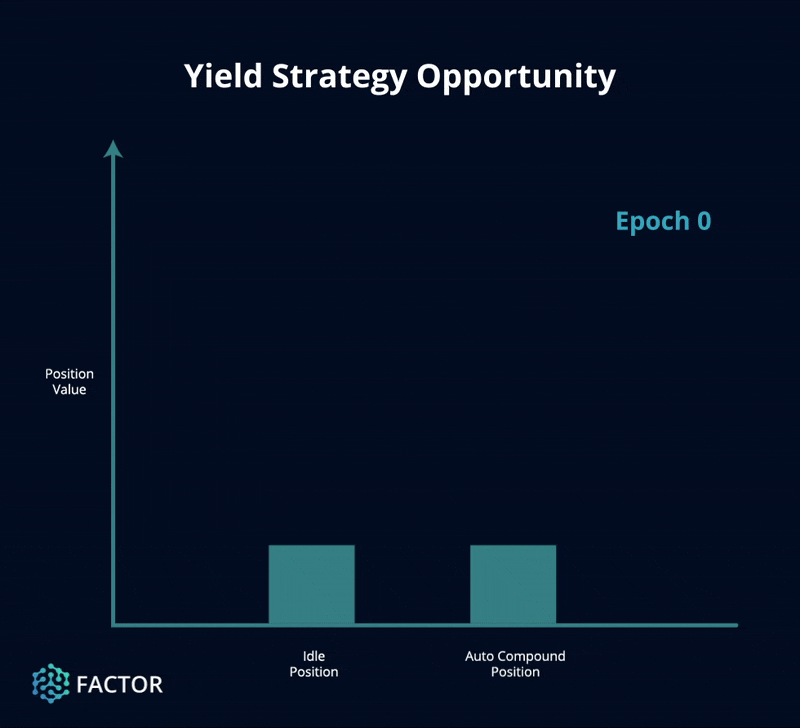

# Yield

## Overview

<figure><figcaption>
Auto-compounding rewards
</figcaption></figure>

The Factor yield strategies automates the process of yield farming on various liquidity protocols. Instead of having to manually harvest liquidity incentives, depositors can just **deposit once into a yield strategy and watch their yields auto-compound**. Factor yield vaults leverages [Gelato Web3 Functions](https://docs.gelato.network/web3-services/web3-functions) to periodically trigger the harvesting of rewards. Not only are the transaction costs incurred per harvest socialized amongst strategy depositors but the higher frequency of harvesting results in upsized yields for depositors.

As each protocol implements their own liquidity incentives, Factor yield strategies are usually tailored to a set of related underlying protocols. Nonetheless, yield strategies generally take the following approach:

1. Users must first provide liquidity to the underlying liquidity protocol to obtain the LP tokens for the target pool
2. The pool LP tokens are then deposited into Factor yield vault
3. Factor stakes the LP tokens into related protocol incentive programs whereupon farming rewards constantly accrue to the liquidity position
4. The strategy defines an optimal harvesting frequency
5. During each harvest event, all the reward tokens accumulated in that period are claimed and swapped for pool tokens
6. The swapped pool tokens are then deposited as additional liquidity in the underlying liquidity protocol and the process is repeated

Note that a higher harvest frequency amplifies the effects of compounding while minimizing the depositor's exposure to reward tokens.

Related Concepts

* [Yield Farming](../../../factor-building-blocks/yield/concepts/yield-farming.md) -> Providing liquidity to protocols which provide significant liquidity incentives


**Strategy Performance & Simulations**

The interactive sheets below are meant help you gain an intuition of the potential strategy returns. Choose your tokens, add your strategy parameters, and see how Factor Auto-Compound strategies simplifies your DeFi journey.

* [Yield Performance Modelling](yield-performance-modelling.md)


## What This Means

By depositing into Factor yield vaults, you can:

* **Amplify returns:** Rewards are harvested and reinvested into your liquidity position more often resulting in greater yields through compounding.
* **Reduce manual overhead:** Yields are auto-compounded periodically without having to constantly  sign each harvest transaction.
* **Reduce gas costs:** The gas costs required to execute the harvest, swap, and reinvestment operations are socialized as the vault combines all of the vault's liquidity adjustments into a single transaction.
* **Reduce exposure to reward tokens:** More frequent reinvestment cycles reduce exposure to protocol reward tokens which are generally more volatile.


**Get Started With Auto-Compounding Strategies!**

You can visit our [Yield User Guides ](../../../factor-studio/studio-discover/yield-user-guides/auto-compound-your-yields.md)if you would like to get started with leverage strategies.


## Examples



### Underlying Protocols

* **Core protocols:**&#x20;
  * [Pendle](https://app.pendle.finance/)
    * Stake PENDLE to get [vePENDLE](https://docs.pendle.finance/ProtocolMechanics/Mechanisms/vePENDLE)
    * Vote on Pendle gauge emission rewards with vePENDLE
    * Receive Base APY rewards from interests collected from YT and matured PT rewards (accrues to vePENDLE)
    * Receive 80% of swap fees from voted pools
    * LP yield from wstETH pool
  * [Lido](https://stake.lido.fi/)
    * Liquid stake ETH to unlocked staked ETH liquidity
  * Ethereum
    * Stake ETH to secure the network and receive PoS yields (consensus voting rewards, priority fees, MEV rewards)
* **Incentive protocols:**
  * [Penpie](https://www.pendle.magpiexyz.io/)
    * Stake PENDLE to get mPendle with boosted yields and boosted Pendle voting power
    * [PNP](https://docs.penpiexyz.io/tokens/pnp-token) emissions allocated to target pools on Penpie
  * [Factor](https://app.factor.fi/)
    * [esFCTR](../../../governance/fctr-token/#esfctr) emission rewards allocated to target pools via [Factor Scale](../../../governance/factor-scale/)

### Strategy Parameters

* **Underlying pool:** wstETH maturing 26 Jun 2025
* **Assets involved:**
  * ETH -> Core underlying asset
  * wstETH -> Primary token for depositing into Pendle
  * PT wstETH -> The principal token of the Pendle wstETH pool representing the principal portion of the locked wstETH on Pendle. Used for depositing on Penpie
  * PENDLE -> Farming rewards for staking LP wstETH in Penpie
  * PNP -> Farming rewards for staking LP wstETH in Penpie
  * wETH -> Intermediary swap output token with deeper liquidity
* **Current TVL** (snapshot 24/04/24)**:** \~1.13K USD
* **Projected Yields** (snapshot 24/04/24)**:**
  * [Lido wstETH](https://stake.lido.fi/) -> 3.2% APR
  * [Pendle wstETH pool ](https://app.pendle.finance/trade/pools/0x08a152834de126d2ef83d612ff36e4523fd0017f/zap/in?chain=arbitrum)-> 7.017% unboosted APY; 11.36% boosted APY (max)
  * [Penpie Lido wstETH](https://www.pendle.magpiexyz.io/stake/0x08a152834de126d2ef83D612ff36e4523FD0017F) -> 9.81% boosted APY (max)
  * [Factor Scale](../../../governance/factor-scale/) -> 264.65% APR

### Strategy Execution

[Yield harvesting loop](https://app.factor.fi/vault/0xfc0D36C2781F26377da6b72Ab448F5b2a71e7D14):

1. Harvest Penpie rewards distributed as PENDLE and PNP
2. Swap PENDLE to WETH (Uniswap V2)
3. Swap PNP to WETH (Camelot)
4. Swap WETH to wstETH (Uniswap V2)
5. Swap wstETH to PT wstETH (Pendle)
6. Stake PT wstETH on Penpie

### Strategy Results

$$
ProjectedAPY = StrategyAPY + ScaleAPY
$$

$$
ProjectedAPY = 10.09\% + 264.65\%
$$

$$
ProjectedAPY = 274.74\%
$$

### Strategy Evaluation

The depositor is projected to earn 274.74% on Factor as compared to 9.81% on Penpie (a \~28x yield multiplier). Even when discounting the Factor protocol rewards, depositors can earn an incremental yield of 10.09% due to the effects of auto-compounding.

### Strategy Risks

It is important to note that during the period of this analysis, the Factor Scale rewards significantly boosted the projected APY as a large proportion of Factor emissions were allocated to limited vault liquidity. Nevertheless, this would make it the perfect time to yield farm.

Of note, [Factor Scale](../../../governance/factor-scale/) rewards are linearly vested as [esFCTR](../../../governance/fctr-token/#esfctr) over 90 days hence are not automatically compounded by the strategy. While this vesting period ensures the long term sustainability of the Factor ecosystem, this also means that  your portfolio will be exposed to [FCTR](../../../governance/fctr-token/#fctr)  price for an extended period. Nevertheless, the [FactorDAO](../../../governance/factordao/) has been implementing long term [tokenomic](../../../governance/fctr-token/#tokenomics) incentives to ensure the growth and evolution of a resilient platform via an actively involved community.&#x20;



### Underlying Protocols

#### [Factor](https://app.factor.fi/)

* Auto-compounding of accrued farming rewards via periodic reinvestment cycles.
* [esFCTR](../../../governance/fctr-token/#esfctr) emission rewards allocated to target pools via [Factor Scale](../../../governance/factor-scale/).
* Direct ERC20 liquidity incentives via [Factor Boost](../../../governance/factor-boost/).
* Boosted Ether.fi Loyalty points.

#### [Penpie](https://www.pendle.magpiexyz.io/)

* Stake LP eETH to earn boosted Pendle rewards via amplified Penpie voting power.
* [PNP](https://docs.penpiexyz.io/tokens/pnp-token) emissions allocated to target pools on Penpie.
* Benefit from the Penpie Bribery Market for boosted emission influence.
* Boosted Ether.fi Loyalty points of up to 2x.

#### [Pendle](https://app.pendle.finance/)

* Exchange weETH for LP eETH.
* Acquire PT eETH at a discount from it's maturity date (i.e. discounted principal portion of yield-bearing asset).
* Receive swap fees on LP weETH as PT eETH is used to market make on the Pendle weETH/PT eETH pool.
* Receive boosted liquidity incentives as staked PENDLE (via Penpie) is used to direct Pendle emissions.

#### [Ether.fi](https://app.ether.fi/)

* Earn additional restaking yields as underlying ETH is used to secure other applications in exchange for a fee.
* Earn Ether.fi Loyalty points.
* Earn EigenLayer Restaking points.

[Lido](https://stake.lido.fi/)

* Auto-compounding of execution layer rewards.

#### [Ethereum](https://ethereum.org/en/learn/)

* Stake ETH to secure the network and receive PoS yields (consensus voting rewards, priority fees, MEV rewards).

### Strategy Parameters

* **Underlying pool:** eETH maturing 27 Jun 2024
* **Assets involved:**
  * [ETH](https://ethereum.org/en/eth/) -> Core underlying asset.
  * [eETH](https://etherfi.gitbook.io/etherfi/ether.fi-whitepaper/eth-re-staking) -> Ether.fi natively restaked rebase token.
  * [weETH](https://etherfi.gitbook.io/etherfi/ether.fi-whitepaper/eth-re-staking) -> Non-rebase version of eETH which staking rewards accrue to. Primary token for depositing into Pendle.
  * [PT eETH](https://docs.pendle.finance/ProtocolMechanics/YieldTokenization/PT) -> The principal token of the Pendle eETH pool representing the principal portion of the locked weETH on Pendle.
  * [LP eETH](https://docs.pendle.finance/ProtocolMechanics/LiquidityEngines/AMM) -> LP tokens representing share of Pendle eETH liquidity pool. Used for depositing on Penpie.
  * [PENDLE](https://docs.pendle.finance/ProtocolMechanics/Mechanisms/vePENDLE) -> Governance token of Pendle. Distributed as farming rewards for providing liquidity on Pendle (via Penpie).
  * [PNP](https://docs.penpiexyz.io/tokens/pnp-token) -> Governance and revenue-sharing token of Penpie. Distributed as farming rewards for staking LP eETH in Penpie.
  * [wETH](https://ethereum.org/en/wrapped-eth/#intro-to-weth) -> Intermediary swap output token with deeper liquidity.

### Strategy Execution

[Yield harvesting loop](https://app.factor.fi/vault/0xfc0D36C2781F26377da6b72Ab448F5b2a71e7D14):

1. Harvest Penpie rewards distributed as PNP
2. Harvest Pendle rewards distributed as PENDLE
3. Swap PNP to WETH (Camelot)
4. Swap PENDLE to WETH (Uniswap V2)
5. Swap WETH to weETH (Balancer)
6. Exchange weETH to LP eETH (Pendle)
7. Stake LP eETH on Penpie


