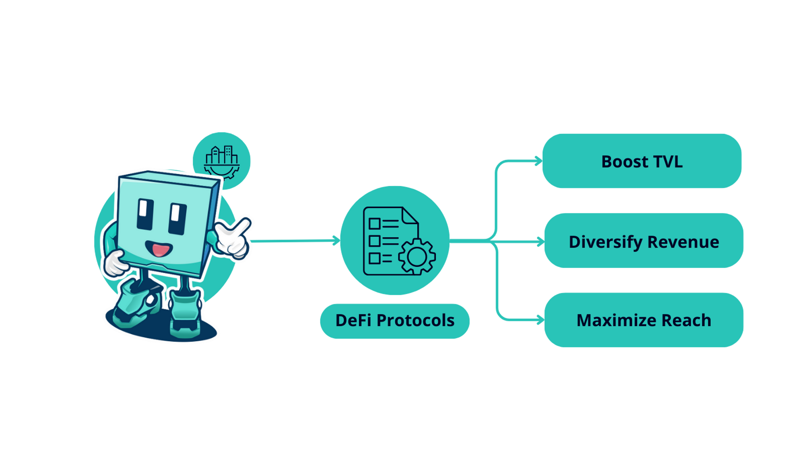

# ✅ Use Cases

<figure><figcaption></figcaption></figure>



## DeFi Protocols

<figure><figcaption></figcaption></figure>

Expand your product suite and grow your ecosystem. With Factor Studio, you can:

* **Boost TVL**: Offer unique strategies that lure users, promoting a cycle of increased visibility and capital inflow.
* **Diversify Revenue**: Monetize custom strategies and structures tailored to your assets, and tap into new revenue streams through incentives.
* **Maximize Reach**: Leverage Factor's extensive network to showcase your innovations to a broader audience.
* **Governance Blackholes**: Easily launch governance blackholes to kickstart ‘wars’ and bribe markets for the protocol’s native token.



### Builders

<figure><figcaption></figcaption></figure>

Transform your ideas into reality using Factor Studio's user-friendly interface.

* **Versatile Creation**: Studio's modular design is not limited to traditional DeFi structures; it opens up boundless possibilities, ranging from single to multi-asset yield, with or without leverage.
* **Barrier Breakdown**: Studio's intuitive interface bridges the gap between idea and execution, allowing even those without extensive coding experience to build and deploy sophisticated DeFi strategies. This paves the way for more innovative projects entering the ecosystem.
* **Speed to Market**: Accelerate the journey to MVP and beyond with Factor Studio. Speed up your development process, enabling you to swiftly launch your project and find your product-market fit.



## Asset Managers/Strategists

<figure><figcaption></figcaption></figure>

Leverage Factor’s infrastructure to launch new vehicles and grow TVL:

* **Customize Offerings**: Design and oversee products and strategies tailored to specific mandates, either using the interface or the SDK.
* **Defined Permissions**: Permissions can be configured to accept deposits only from pre-approved wallet addresses. This allows the implementation of regulatory processes like KYC in compliance with your jurisdiction's requirements.
* **Automated Actions**: Factor's programmatic building blocks can automate actions like portfolio rebalancing, following predefined rules and logic for seamless execution.



## Allocators

<figure><figcaption></figcaption></figure>

Whether you are a treasury manager, on-chain fund, or an individual, Factor serves as a gateway to a vast ecosystem of tailored opportunities and projects.

* **Customized Allocation Pathways**: Every strategy has its nuances. With Factor, you have all the tools you need to select strategies that align with your specific risk parameters, objectives, and asset inclinations.
* **Efficient Exploration with Layered Filtering**: Skip the tedious deep dives and manual sifting. Factor's advanced filters quickly direct you to the most promising strategies that match your specific criteria.
* **Stay at the Forefront**: The DeFi landscape is constantly evolving. With Factor, you're always up-to-date with the latest strategies and innovations in the ecosystem.


