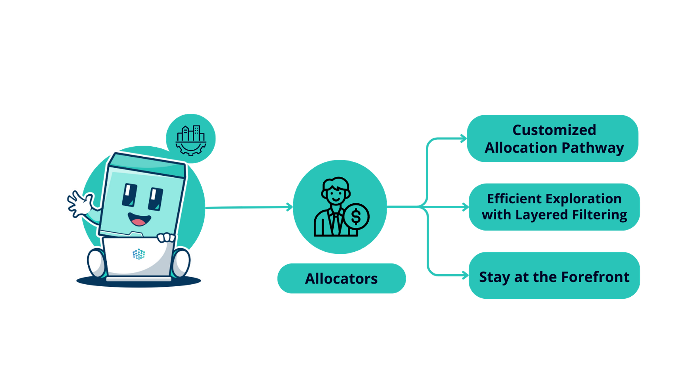

# Allocators

## Overview

<figure><figcaption></figcaption></figure>

Whether you are a treasury manager, on-chain fund, or an individual, Factor serves as a gateway to a vast ecosystem of tailored opportunities and projects.

* **Customized Allocation Pathways**: Every strategy has its nuances. With Factor, you have all the tools you need to select strategies that align with your specific risk parameters, objectives, and asset inclinations.
* **Efficient Exploration with Layered Filtering**: Skip the tedious deep dives and manual sifting. Factor's advanced filters quickly direct you to the most promising strategies that match your specific criteria.
* **Stay at the Forefront**: The DeFi landscape is constantly evolving. With Factor, you're always up-to-date with the latest strategies and innovations in the ecosystem.
