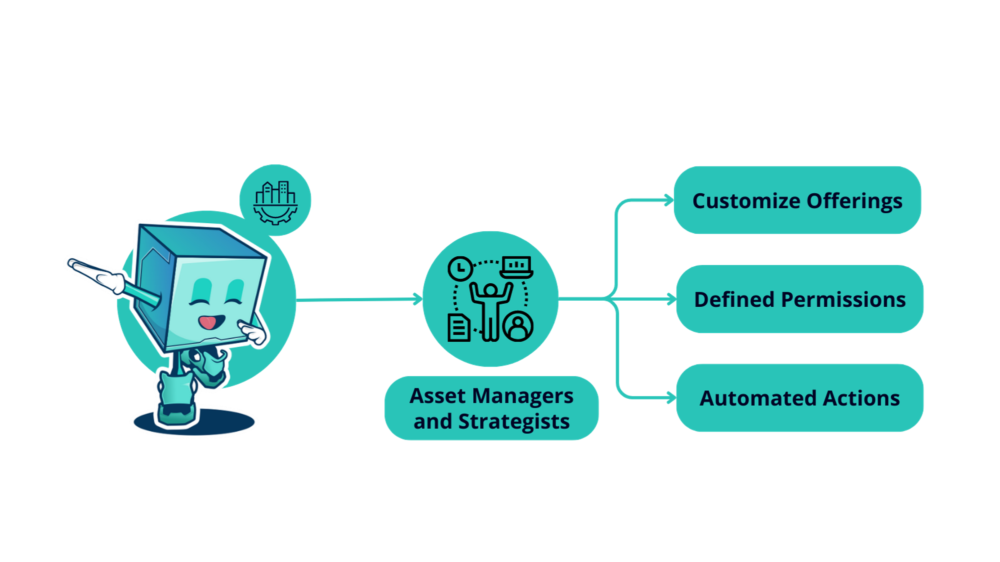

# Asset Managers and Strategists

## Overview

<figure><figcaption></figcaption></figure>

Leverage Factor’s infrastructure to launch new vehicles and grow TVL:

* **Customize Offerings**: Design and oversee products and strategies tailored to specific mandates, either using the interface or the SDK.
* **Defined Permissions**: Permissions can be configured to accept deposits only from pre-approved wallet addresses. This allows the implementation of regulatory processes like KYC in compliance with your jurisdiction's requirements.
* **Automated Actions**: Factor's programmatic building blocks can automate actions like portfolio rebalancing, following predefined rules and logic for seamless execution.
