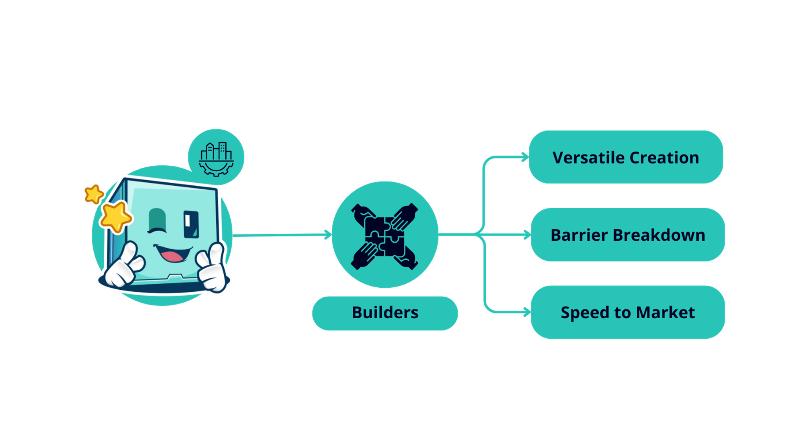

# Builders

## Overview

<figure><figcaption></figcaption></figure>

Transform your ideas into reality using Factor Studio's user-friendly interface.

* **Versatile Creation**: Studio's modular design is not limited to traditional DeFi structures; it opens up boundless possibilities, ranging from single to multi-asset yield, with or without leverage.
* **Barrier Breakdown**: Studio's intuitive interface bridges the gap between idea and execution, allowing even those without extensive coding experience to build and deploy sophisticated DeFi strategies. This paves the way for more innovative projects entering the ecosystem.
* **Speed to Market**: Accelerate the journey to MVP and beyond with Factor Studio. Speed up your development process, enabling you to swiftly launch your project and find your product-market fit.
