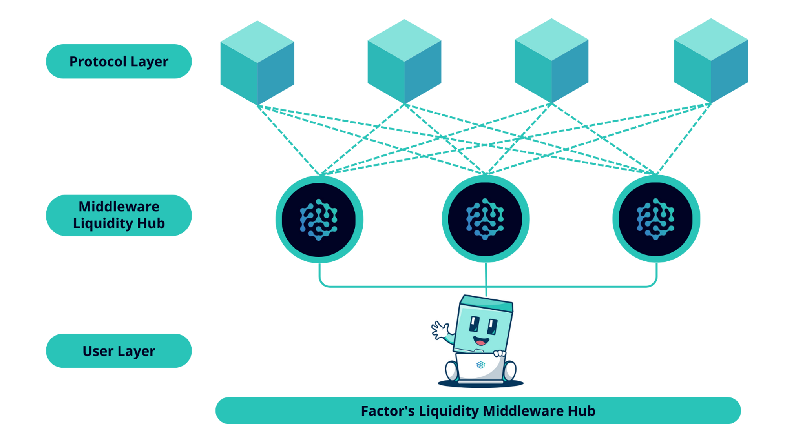

# 🌐 Why Factor?

## DeFi Problem

To transform DeFi from a niche, siloed billion-dollar industry into a widely adopted trillion-dollar industry. We can do this by providing a secure, no-code, one-click infrastructure to aggregate core DeFi products and liquidity.

But first we must overcome a number of challenges! DeFi is an early-stage, fragmented market that faces a huge number of barriers to entry. These issues range from technical to usability to perception. Let’s break down some of the key issues one by one.

### **Siloed protocols**

DeFi 1.0 burst onto the scene with the likes of Aave and Uniswap, creating the ability to lend, borrow and trade. Robust products have stood the test of time. But standalone products with the potential to do so much more.

### **Limited flexibility**

Innovators like Curve and Yearn Finance emerged creating the first iteration of aggregated DeFi products and yields. Great products (that Factor can utilize) but still somewhat siloed and limited in flexibility.

### **Technical barriers**

If a user does want to create their own innovative products or vaults, the process is still very complex. Multiple chains and protocols, fees, impermanent loss, rapidly changing emissions, yields and market conditions. Limiting challenges for most!

### **Complex user journeys**

There are great tools out there like DeFi Llama, but even if you have the expertise aggregated info and execution are still lacking. It’s a full-time job to keep track of, manage and execute, and requires a degree of skill that limits adoption.

### **Inability to fractionalize**

Now let’s say you do have the skills and expertise and want to benefit from that (like asset managers in the traditional finance world)! There are minimal options to aggregate your strategies, fractionalize them for the masses, and earn from them.

### **Lack of transparency**

Let’s say you can achieve that, there’s still a lack of transparency. Yes, everything is on the chain but clear strategy/vault metrics are often lacking. It makes it hard for asset managers to market, and hard for investors to trust.

## Factor as The Building Blocks of DeFi

Factor resolves the mentioned issues by offering a sophisticated yet user-friendly solution. The objective is to establish a framework that enables protocols and builders, even those without coding expertise, to effortlessly create their own decentralized finance instruments.

<figure><figcaption></figcaption></figure>

This objective forms the essence of Factor's purpose. We function as the intermediary that connects previously inaccessible opportunities, or in other words, Factor serves as the Middleware. Within Factor, both innovation and the DeFi ecosystem thrive.

Factor main DeFi suites can be read more in [here](https://www.notion.so/54c2698260a04856bb8032fe5e4a68a2?pvs=21)
