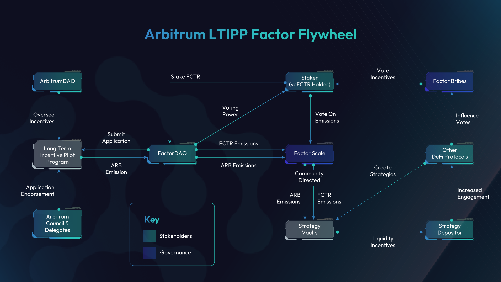

# Arbitrum Foundation LTIPP

## Overview

<figure><figcaption>
LTIPP Flywheel
</figcaption></figure>

Factor is forever grateful to the Arbitrum Community for their [endorsement](https://snapshot.org/#/arbitrumfoundation.eth/proposal/0xb130d7261e821b87547910a32c29275bfd85edbe395bd15fe0a8f1d97738af47) of [Factor’s LTIPP application](https://forum.arbitrum.foundation/t/factor-ltipp-application-draft/21922).  The 340,000 ARB which has been earmarked for distribution over 12 weeks will be disbursed according to community votes on [Factor Scale](./). This means that in addition to Factor emissions of up to 100,000 [FCTR](../fctr-token/#fctr) weekly, the Factor community will able direct a further \~28,333ARB as liquidity incentives to various Factor strategy vaults.

Arbitrum Foundation's [Long Term Incentives Pilot Progam](https://forum.arbitrum.foundation/t/long-term-incentives-pilot-program/20223) aims to drive greater network engagement by enabling the [ArbitrumDAO](https://arbitrum.foundation/) to direct protocol funds as liquidity incentives towards synergistic projects building on Arbitrum. The awarded LTIPP amount will be redistributed to the Arbitrum community as liquidity incentives via the recipient's protocol. This incentivizes Arbitrum users to try out up-and-coming use cases while generating greater network activity, a mutually beneficial arrangement for all.


Factor LTIPP Application on Arbitrum Foundation Forum



Factor LTIPP Community Vote Snapshot


## Factor LTIPP Distribution

<table><thead><tr><th width="257">Distribution Details</th><th>Value</th></tr></thead><tbody><tr><td>LTIPP Amount</td><td>340,000 ARB</td></tr><tr><td>Distribution Period</td><td>12 weeks</td></tr><tr><td>Distribution Method</td><td>1:1 mirror with <a href="./">Factor Scale</a> votes</td></tr></tbody></table>

To ensure the most democratized use of ArbitrumDAO funds, LTIPP ARB will be distributed to various Factor strategy vaults based on the proportion of votes allocated by [FCTR](../fctr-token/#fctr) stakers. By [staking FCTR](../factordao/user-guides/stake-fctr.md) on the [FactorDAO](../factordao/), users become eligible to [vote](./#voting-process) on the distribution of protocol emissions (via [Factor Scale](./)) which includes the LTIPP ARB for the duration of the LTIPP program. A FCTR staker's voting power is directly correlated to their staked duration as well as protocol liquidity contributions thereby incentivizing votes with a longer term focus.


**Community Directed Incentives**

Please visit the [Factor Scale](./) page to learn more about the voting process and how Factor is democratizing. protocol emission distributions.


## What Does This Mean?

### FCTR Stakers

* **Direct Even More Rewards:** Your votes are about to get much more valuable as each [veFCTR](../fctr-token/#vefctr) now controls a larger pool of liquidity incentives.
* **Get Paid To Vote:** You can monetize your voting power by participating in [Factor Bribes](../factor-bribe/) market where protocols might decide to allocate voting rewards to incentivize more liquidity for target strategy vaults.
* **Increased FCTR Utility:** By staking [FCTR](../fctr-token/#fctr) for longer, you get more voting power and access to additional rewards while supporting the long-term growth of the Factor ecosystem.

### Strategy Depositors

* **Increase Your Yields:** Every dollar of liquidity deposited into [Factor Scale](./) vaults will receive significantly more liquidity rewards based on the upsized emissions.&#x20;
* **Diversify Your Rewards:** In addition to FCTR tokens, you will also receive ARB tokens as liquidity rewards for depositing into target strategy vaults.

### Protocols

* **Supercharged Capital Efficiency:** Generate even greater returns on any protocol tokens designated as liquidity incentives by participating in [Factor Bribes](../factor-bribe/). Each dollar allocated as Bribe rewards has the potential to influence even greater emission rewards towards your selected strategy vault.
