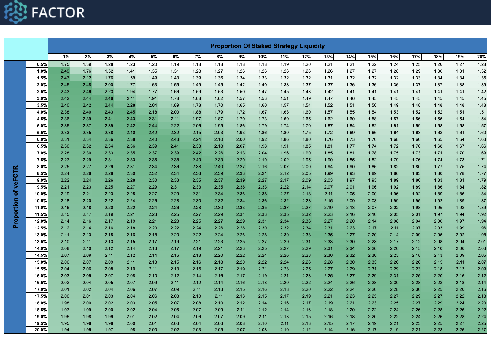

# Emissions Multiplier Model

<figure><figcaption></figcaption></figure>


**Try It Out!**

You can create a copy of the [Google Sheet](https://docs.google.com/spreadsheets/d/1i3eCsK3VgPhPX5cADZnmdNlaTk8T9iZKjF0s4iuT-f4/edit?usp=sharing) to tweak the parameters according to your own assumptions.

