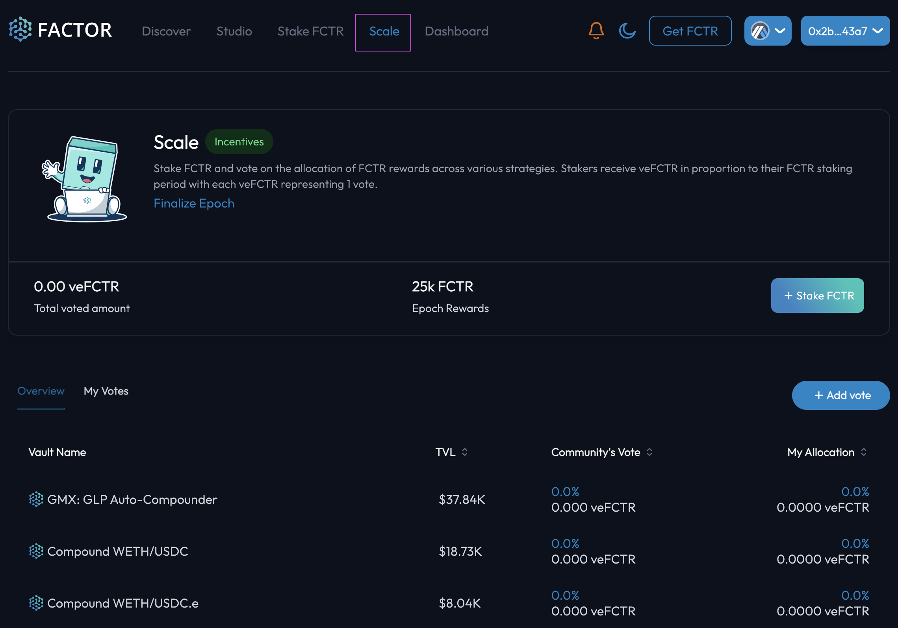
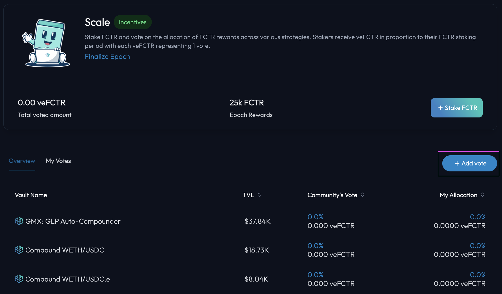
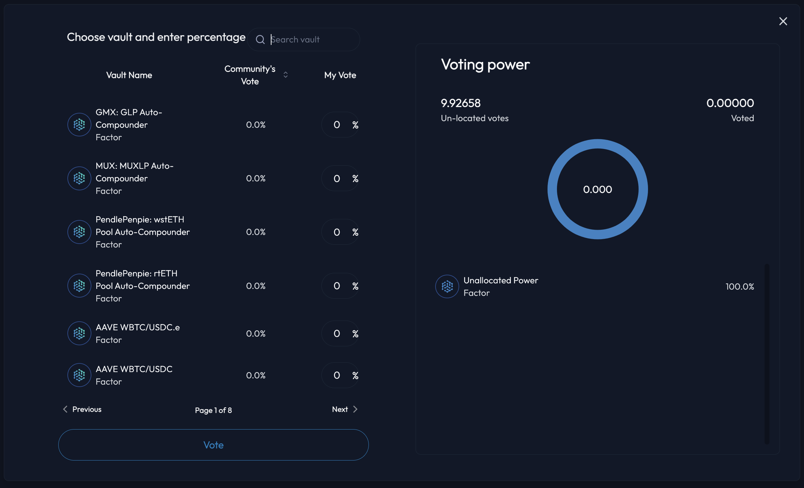
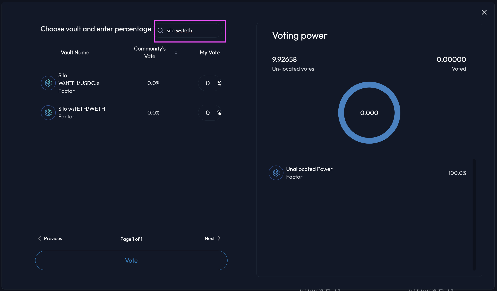
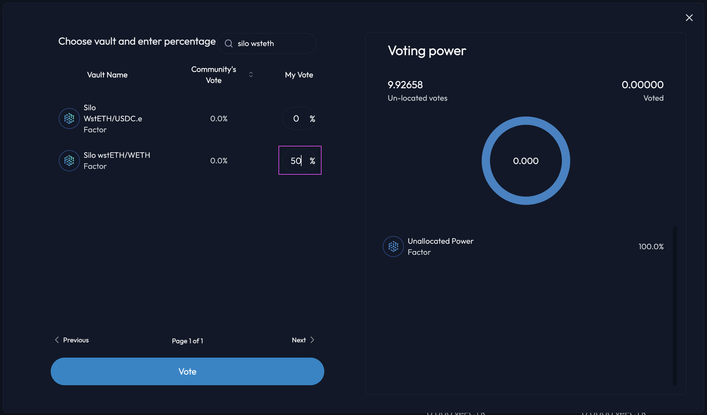
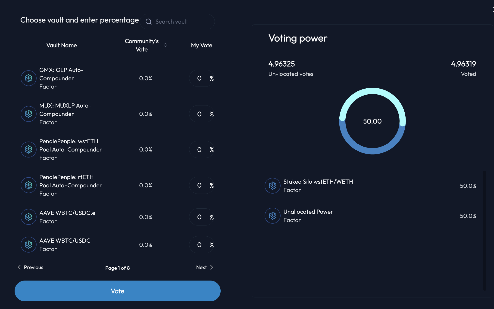
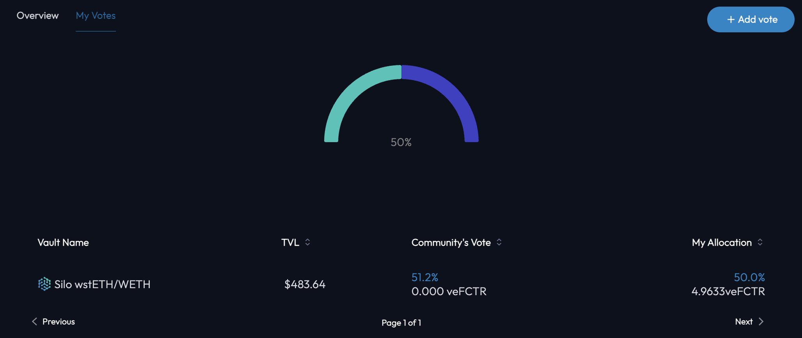

# Vote On Emissions Distribution

## Introduction

By voting with your [veFCTR](../../fctr-token/) on [Factor Scale](../), you will be able to influence the distribution of Factor emission rewards to your preferred strategy vaults. Factor has allocated up to 100,000 [FCTR](../../fctr-token/#fctr) per epoch to be allocated to curated strategies based on [veFCTR](../../fctr-token/#vefctr) voting on [Factor Scale](../). By allocating your vote (i.e. 1 [veFCTR](../../fctr-token/#vefctr):1 vote) to a strategy, you are directing a proportion of the emission rewards to the vault based on your protocol contributions.


**Vote Carryover**

Note that while your votes will be carried over automatically to the next voting epoch, any newly acquired [veFCTR](../../fctr-token/#vefctr) after your initial vote confirmation will not be counted.

That is, any additional [FCTR](../../fctr-token/#fctr) staked will require another round of voting confirmation to be counted towards the next epoch.



**Emissions Multiplier**

Factor Scale implements an emissions multiplier for every veFCTR used to vote on the emissions rewards. More details on the voting process can be found [here](../#voting-process).


## Vote For Your Favourite Strategies

### Step 1: Access Factor Scale

Navigate to the [Factor Scale page](https://app.factor.fi/incentives/scale) to start influecing emmission rewards. If you're already on the Factor [dapp](https://app.factor.fi/discover), you can access Factor Scale via the "Scale" option in the navigation bar.

<figure><figcaption>
Factor Scale page
</figcaption></figure>

### Step 2: Add your votes

Once, you're on the Scale page, you can start to allocate your votes by selecting the "Add vote" button which will open up the strategy vault picker.

<figure><figcaption>
Vote with your veFCTR
</figcaption></figure>

### Step 3: Navigating the vault picker

Factor Scale enables you to search for your favourite [curated vaults](https://docs.factor.fi/governance/factor-scale#overview) and allocate a percentage of your total voting power towards it via a vault picker pop-up. You will also be able to see your total voting power, vote allocations,  as well as any unallocated vaults to the right of the pop-up.

<figure><figcaption>
Pop-up to select your vaults
</figcaption></figure>

### Step 4: Search for your vault

With so many strategies being created on Factor, navigating them all (even the curated ones) is a task hence the pop-up provides a convenient search function. You will be able to search for your vault by typing the vault name into the search bar.

<figure><figcaption>
Search for vaults
</figcaption></figure>

### Step 5: Allocate your votes

Once you've found your desired vault, you can then specify a percentage of your total voting power that will be allocated to that vault. Note that the sum of all the percentages across unallocated and allocated votes can not exceed 100%.

<figure><figcaption>
Allocate voting power to a vault
</figcaption></figure>

### Step 6: Confirm your vote allocation&#x20;

Once you're happy with how your votes will be distributed, click on the "Vote" button to confirm your choice. This will require a signature as your votes are recorded on-chain. Upon confirmation, you will be able to view your updated votes distribution.

<figure><figcaption>
Distribution of votes
</figcaption></figure>

You can even view your allocation in more details by visiting the My Votes tab under the main [Scale page](https://app.factor.fi/incentives/scale).

<figure><figcaption>
My votes
</figcaption></figure>
