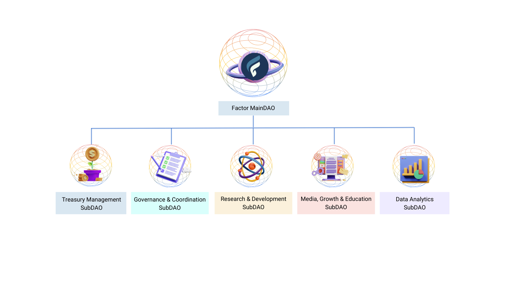

# 🏛 FactorDAO

## Introduction

We believe that community governance and a robust process will benefit Factor's ecosystem. The DAO will enhance decentralization by having members participate in the protocol's governance and guiding it to new heights.

The community will also be incentivized to grow the protocol's value by expanding its ecosystem with new products, partnerships, as well as research to help the DAO make informed decisions. We want to create a vibrant, research-driven community that benefits anyone interacting with the platform.

## Participating In Factor Governance

DAO members may lock their $FCTR tokens to accumulate $veFCTR - the native, non-transferable governance token, and take part in the DAO’s governance mechanism by voting and submitting proposals.

Longer lock-up periods result in greater $veFCTR emissions to incentivize long-term involvement within the community. Members who actively participate in the governance process will receive $FCTR as a reward for supporting the decentralization of the DAO.

## **MainDAO and SubDAO Structure**

Here is a high-level execution plan for how Factor can become a DAO with multiple arms working together to build a comprehensive DeFi ecosystem:

<figure><figcaption></figcaption></figure>

### **Factor MainDAO**

This is the backbone of the Factor DeFi ecosystem and will be composed of several operational subDAOs. The mainDAO will oversee the operations of these subDAOs, and make sure that all efforts are aligned with the overall mission and vision of Factor.

### **Treasury Management SubDAO**

This subDAO will manage the funds and assets held in the Factor treasury, ensuring optimal returns and risk management.

### **Governance and Coordination SubDAO**

This subDAO will manage the governance and decision-making processes of the Factor DAO, ensuring that the community has a say in the direction and future of the protocol, as well as synergizing between the different subDAOs

### **R\&D SubDAO**

This subDAO will fund and manage the development of new features and improvements to the Factor protocol, ensuring its continued growth and evolution.

### **Media, Growth, and Education SubDAO**

This subDAO will be responsible for building a strong media presence for Factor. This will be achieved through initiatives such as podcasts, newsletters, and other content that educates and informs the DeFi community about all things related to Factor. The goal is to create a trusted source of information for the community and help build brand recognition and drive growth. Brands: The Key Factor, The Risk Factor, The DeFi Factor(y)

### **Data Analytics SubDAO**

A data analytics platform powered by Factor and integrated with Factor's apps, providing valuable data and dashboards to help users make informed decisions about their DeFi exposure.

## **SubDAO Implementation**

A novel way to leverage QV in subDAOs is through the use of “quadratic funding”, which uses the same logic of quadratic vote allocation, but for the allocation of funds. The mainDAO could use quadratic funding to allocate grants to subDAOs by creating a pool for fund matching and then allocating funds based on a quadratic voting formula.

This formula would count the initial donations as votes. This could be done in two ways: either through an open call for proposals from subDAOs, or through the direct allocation of funds from the mainDAO’s budget. Either way, this method would ensure that resources are allocated efficiently and accurately represent the community’s sentiment.
