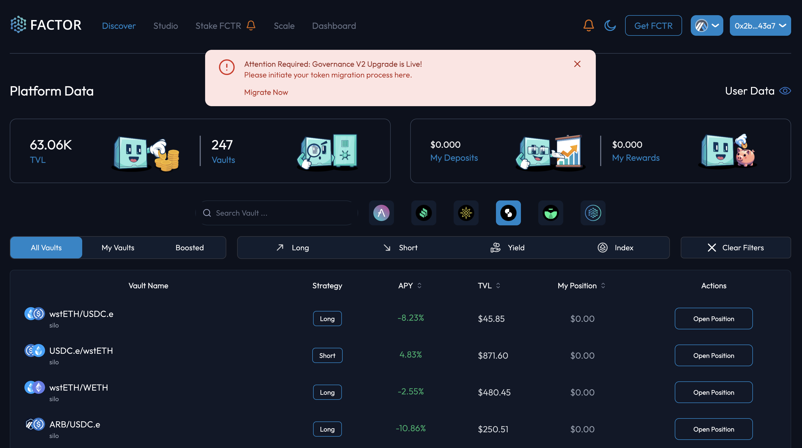
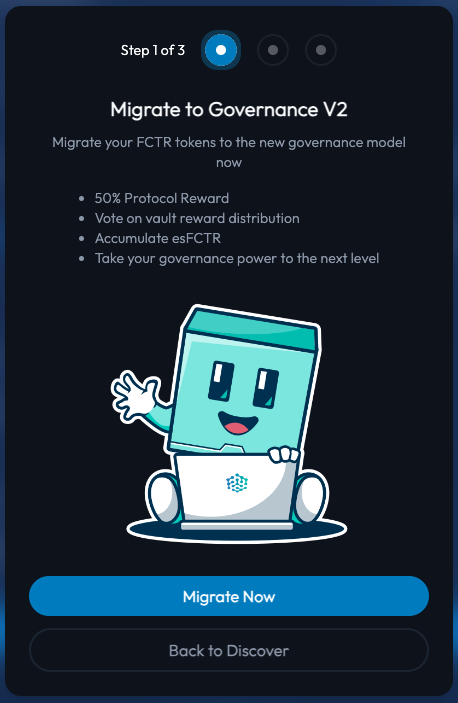
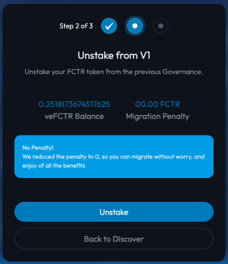
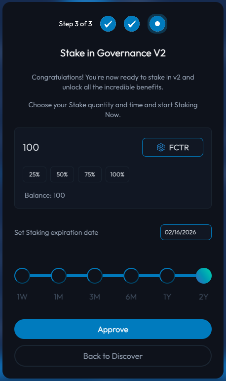
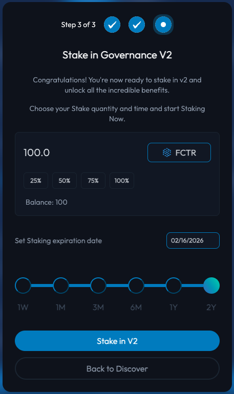

# Governance Migration


**New To FactorDAO?**

If this is your first time staking in FactorDAO, please visit the [Stake FCTR](stake-fctr.md) page for a guide on how to get started.


## Introduction

On the 27th Feb 2024 0500AM UTC, Factor officially launched a upgraded staking model which aims to simplify the staking process and enhance the incentives for long-term staking. This was a major upgrade to the existing governance design and required the creation of a new governance contract to support more advanced benefits. Such benefits include:

* **A Simplified Staking Model**: Factor redesigned the staking mechanism to be more intuitive and user-friendly, removing complexities for a smoother user experience.
* **Reduced Staking Duration**: Responding to feedback, the maximum staking period was reduced from four years to two, giving stakers more flexibility to manage their governance contributions and rewards.
* **Enhanced Incentives for Long-term Staking**: Committed Factorians can opt for the maximum staking period, and enjoy up to a 2.5x multiplier on their emission rewards for amplified returns.


**Waiver Of Unstaking Fees**

To facilitate a seamless transition to the new governance model, the unstaking fees for vested positions in the old governance contract has been waived. This ensures that Factorians are able to access all of the benefits of the new staking model as soon as possible.


## **Migrating to the new governance contract**

### **Step 1: Migration notification**

Visit the [Factor legacy dapp](https://legacy.factor.fi/) and ensure that you're connected with the same address that was used for staking in the previous governance contract. For Factorians with an existing staked position, you should see a notification banner indicating your eligibility for the migration.

<figure><figcaption>
Migration notification
</figcaption></figure>

### Step 2: Migration pop-up

Upon clicking the banner, the migration pop-up helper will be displayed where you can read in brief about the new Factor governance model and its benefits.

<figure><figcaption>
Migration pop-up
</figcaption></figure>

### Step 3: Undelegate V1 staking position (if delegated)

For stakers who had previously delegated their staked [FCTR](../../fctr-token/#fctr), you will be prompted to undelegate prior to unstaking. This can be easily completed by clicking the "Undelegate" action button in the pop-up which will then require the transaction to be signed.

### Step 4: Unstake from V1 governance contract

The migration pop-up will display your total [veFCTR](../../fctr-token/#vefctr) balance that is currently being staked in the v1 governance contract. You will be able to unstake all of your [veFCTR](../../fctr-token/#vefctr) by selecting the "Unstake" button. This will require a transaction to be signed.

<figure><figcaption>
Unstake veFCTR pop-up
</figcaption></figure>

**Note that the unstaking penalties have been waived for the migration.**

### Step 5: Approve the new governance contract

Once your [veFCTR](../../fctr-token/#vefctr) has been unstaked, you are now able to stake in the new governance contract by selecting a [FCTR](../../fctr-token/#fctr) staking amount and staking duration. Note that as this is a new governance contract, you will have to provide an approval for the contract to manage your [veFCTR](../../fctr-token/#vefctr) tokens.

<figure><figcaption>
Approve new governance contract
</figcaption></figure>

### Step 6: Stake in the new governance contract

Once the approval has been given, you can now proceed to stake in the new governance contract by selecting the "Stake in V2" button. This will require a transaction to be signed.

Note that this will immediately stake your specified [FCTR](../../fctr-token/#fctr) tokens for the period specified. By staking your [FCTR](../../fctr-token/#fctr) for longer, you will receive more [veFCTR](../../fctr-token/#vefctr) which represents a greater share of votes as well as rewards allocation. The [veFCTR](../../fctr-token/#vefctr) received from staking can only be unstaked following the selected staking period.

<figure><figcaption>
Stake in the new governance contract
</figcaption></figure>

That's it! Once your staking transaction is confirmed, you will be ready to vote on various FactorDAO governance proposals as well as benefit from various Factor ecosystem incentives.
