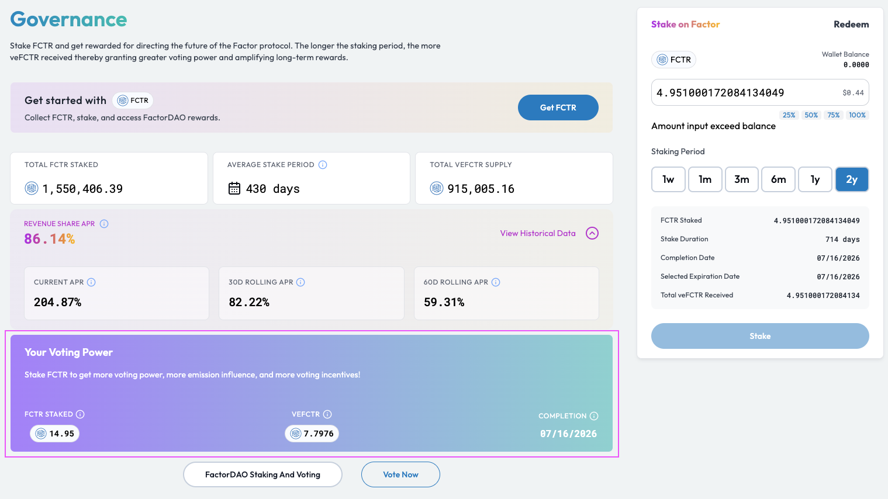

# Stake FCTR

## Overview

Staking [FCTR](../../fctr-token/#fctr) is the first step to towards Factor governance participation. By staking [FCTR](../../fctr-token/#fctr), users become eligible to vote on FactorDAO proposals as well as gain access to a host of other benefits such as 50% protocol revenue share and emission rewards weighted voting.


**Governance Migration**

For Factorians who have staked position prior to 27th Feb 2024 0500AM UTC, please refer to [Governance Migration ](migrate-from-v1-to-v2.md)for a guide on how to migrate your existing staked position to the newest staking model.


## Stake FCTR To Participate In Factor Governance

### Step 1: Staking your FCTR tokens

Navigate to the [governance page](https://pro.factor.fi/governance/stake) on the Factor dapp. This can be done via selecting the "Stake FCTR" tab on the navigation bar.

<figure><figcaption>
Stake your FCTR
</figcaption></figure>

You will be able to view basic information about staked FCTR on this page. This includes your own [veFCTR](../../fctr-token/#vefctr) balance, if any.

### Step 2: Approve the governance contract

If this is your first time staking with Factor, you will be required to approve the governance contract. This requires a signature as it allows the contract to manage your [FCTR](../../fctr-token/#fctr) tokens.

Enter the amount of [FCTR](../../fctr-token/) tokens to be staked and you should be prompted to approve the contract for the specified amount.

### Step 3: Select your staking duration

Once approval has been given, you can then select your staking duration which ranges from a minimum of 1 week all the way to a maximum of 2 years. The longer your [FCTR](../../fctr-token/#fctr) stake, the more [veFCTR](../../fctr-token/#vefctr) you will receive thereby representing a greater share of votes as well as rewards allocation. The [veFCTR](../../fctr-token/#vefctr) received from staking can only be unstaked following the selected staking period.

The amount of veFCTR you will receive for your selected staking amount and duration is displayed at the bottom.

<figure><figcaption>
Select staking period
</figcaption></figure>

### Step 4: Stake FCTR

Upon selecting the "Stake" button, you will be prompted to sign the transaction in your wallet.  Once the transaction is confirmed, you will be able to view your new [FCTR](../../fctr-token/#fctr) and [veFCTR](../../fctr-token/#vefctr) balance.

<figure><figcaption>
Staked FCTR and veFCTR balance
</figcaption></figure>

That's it! You are now ready to vote on various FactorDAO governance proposals as well as benefit from various Factor ecosystem incentives.
