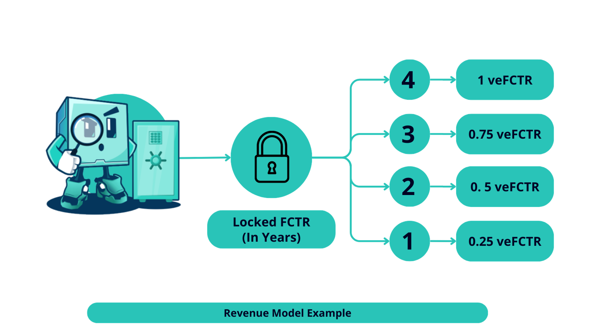
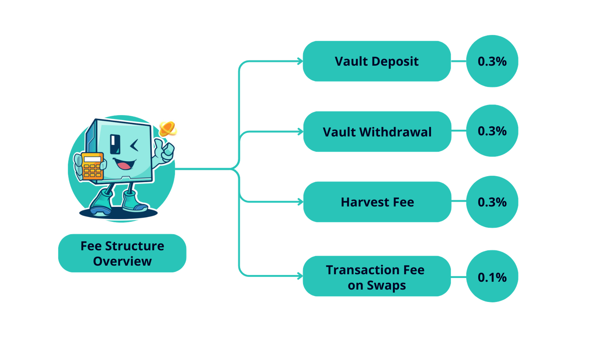

# 💵 Platform Fees

### Revenue Model

<figure><figcaption></figcaption></figure>

Factor generates its primary revenue through transaction-based fees, encompassing charges for activities such as deposits and withdrawals, transaction fees on swaps, and a percentage of creator fees (management and performance fees).

The platform is designed to balance revenue generation while incentivizing creator participation through fee discounts for staked $FCTR holders.

### Platform Fees

<figure><figcaption></figcaption></figure>

Factor generates its primary revenue through transaction-based fees, encompassing charges for activities such as deposits and withdrawals, transaction fees on swaps, and a percentage of creator fees (management and performance fees).

The platform is designed to balance revenue generation while incentivizing creator participation through fee discounts for staked $FCTR holders.

### **Fee Structure**

#### **Strategies (Yield/Baskets)**

* **Deposit Fee**: A 0.3% fee is applied to the amount deposited into any strategy.
* **Withdrawal Fee**: Withdrawals incur a 0.3% fee.
* **Swap Fee**: A 0.1% fee is charged per swap, applicable to rebalancing and compounding actions within strategies.
* **Harvest Fee**: A combined fee of 0.3% plus a 0.1% swap fee is levied on community-generated vaults.

#### **Leverage (Lending)**

* **Leverage Fees**: Adding leverage incurs a fee of 0.1%
* **Collateral Management**: Both adding and removing collateral are subject to a 0.1% fee.
* **Debt Management**: Repaying or refinancing debt, and adjusting leverage levels each carry a 0.1% fee.
* **Position Management**: Swapping debt tokens or collateral, and closing positions, also incur a 0.1% fee.
* **Liquidation Fee**: Liquidations incur a 5% fee on top of fees imposed by underlying protocols.

#### Zap

* Factor charges no fees for Zap. However, underlying AMMs may charge transaction fees.
