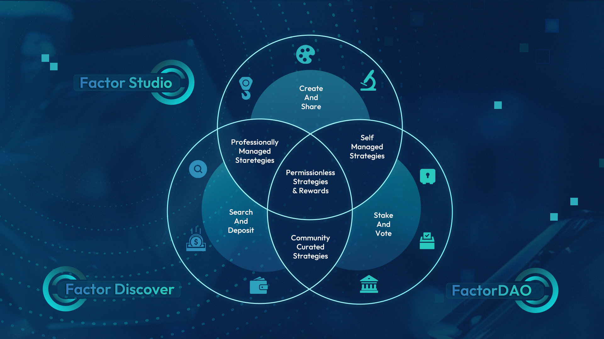

# Press Kit

## Overview

**Website:** [https://factor.fi/](https://factor.fi/)

**Lead Team:**

<table data-view="cards"><thead><tr><th></th><th></th><th data-hidden></th><th data-hidden data-card-cover data-type="files"></th><th data-hidden data-card-target data-type="content-ref"></th></tr></thead><tbody><tr><td><strong>Founder</strong></td><td>Kurapika</td><td></td><td><a href="../.gitbook/assets/ProfPic_Kurapika.jpeg">ProfPic_Kurapika.jpeg</a></td><td><a href="https://twitter.com/Kurapika_DAO">https://twitter.com/Kurapika_DAO</a></td></tr><tr><td><strong>Product Manager</strong></td><td>Andrea0x_eth</td><td></td><td><a href="../.gitbook/assets/ProfPic_Andrea.jpeg">ProfPic_Andrea.jpeg</a></td><td><a href="https://twitter.com/Andrea0x_eth">https://twitter.com/Andrea0x_eth</a></td></tr></tbody></table>

**Launched**: February 2022

**Mission:** Building the Composable Layer of DeFi

**Vision:** _At Factor, we envision a world where the path to financial autonomy is unrestricted by technological barriers, with Factorians fostering an inclusive environment that empowers the builders of the next billion DeFi strategies._

**Contact:**

<table data-view="cards"><thead><tr><th></th><th></th><th data-hidden></th><th data-hidden data-card-target data-type="content-ref"></th></tr></thead><tbody><tr><td><strong>General Enquiries</strong></td><td><a href="mailto:info@factor.fi">info@factor.fi</a></td><td></td><td><a href="mailto:info@factor.fi">mailto:info@factor.fi</a></td></tr><tr><td><strong>Media Enquiries</strong></td><td><a href="mailto:media@factor.fi">media@factor.fi</a></td><td></td><td><a href="mailto:media@factor.fi">mailto:media@factor.fi</a></td></tr><tr><td><strong>Partnership Enquiries</strong></td><td><a href="mailto:partnerships@factor.fi">partnerships@factor.fi</a></td><td></td><td></td></tr></tbody></table>

***

## About Factor

ACE - Accessible, Composable, and Efficient.

Factor is realising a future where building and automating complex DeFi strategies are as simple as a drag-and-drop, no coding required.&#x20;

At Factor, we are democratising access to open and permissionless financial rails by equipping users with powerful but intuitive tools that abstracts the intricacies of getting cross-protocol DeFi strategies to market.&#x20;

Factor promotes a thriving DeFi community by empowering users to create shareable strategies that are open to all.

<strong>Strategy Creators</strong>

Combine varying strategies from multiple DeFi protocols into one automated strategy using Factor Studio's drag-and-drop interface.

<strong>Strategy Managers</strong>

Have what it takes to consistently create successful strategies? Shorten your time to market and earn more fees by allowing users to deposit to your automated strategies.

<strong>Depositors</strong>

Participate in professionally-managed and community-curated strategies by depositing funds into automated strategy vaults to earn passive yield.

<strong>Developers</strong>

Leverage the Factor SDK to effortlessly create custom strategies directly on your app or backend without having to worry about protocol integration specifics.

<strong>Protocols &#x26; DAOs</strong>

Generate permissionless protocol incentives and distribution systems with ease while benefitting from Factor's revenue share or partnership funds.

<strong>Factorians</strong>

Stake $FCTR and participate in building the future of Factor while earning long term protocol incentives.

With integrations across multiple protocols, Factor is a user-friendly and secure gateway to the rest of DeFi. All of Factor's smart contracts are audited by [PeckShield](../security/audits/peckshield/) & [SourceHat](../security/audits/sourcehat/) with live contracts being actively monitored by Chainalysis. Whether you're a protocol, treasury, builder, or individual strategist, Factor streamlines your path to financial autonomy, ensuring a seamless journey for all.

Factor is governed by the FactorDAO, a community-owned platform that empowers FCTR token holders to participate in the governance of the protocol. By aligning protocol growth with long-term individual incentives, the FactorDAO places FCTR holders at the center of Factor’s future. FactorDAO consensus guides the direction of the Factor team which operates a fully remote ream with \~25 builders spread around the globe.

#### _Create, leverage & innovate your DeFi strategies with_ [_Factor_](https://factor.fi/)_._

> _Factor was founded with a mission to revolutionise DeFi by creating a composable yet flexible layer that simplifies earnings for builders and strategists. We're not just building a platform; we're laying the foundation for a new building blocks era of democratising financial accessibility and empowerment._
>
> \- Kurapika, Co-Founder

***

## Factor Solutions

<figure><figcaption>
Factor Solutions Overview
</figcaption></figure>

### Factor Studio

Factor Studio is a one-stop platform for creating Accessible, Composable, and Efficient DeFi strategies. Factor Studio reimagines how DeFi strategies can be created and shared via creating synergies between various Factor products.



Studio enables Creators to combine varying strategies from multiple DeFi protocols into one automated strategy. Just connect your wallet to the Factor dapp and gain access to an infinite world of DeFi opportunities, no coding required.

* **Features:** Mix-and-Match Strategies Across DeFi, Intuitive No-Code Interface, Deploy Automated Strategies Permissionlessly



Studio Pro (coming soon!) significantly shortens the time to market for deploying managed and automated DeFi strategies. By optimising the strategy workflow for Managers, Studio Pro facilitates rapid iterations of managed vaults resulting in more efficient allocation of deposits and their corresponding fees.

* **Features:** Create Automated Managed Strategies, Simplified Strategy Deployment Workflow, Transparent And Automated Fees



### Factor Discover

Factor Discover bridges the gap between professional strategy builders and DeFi users by providing an intuitive interface for users to explore and participate in a diverse array of professionally managed DeFi strategies.

* **Features:** Professionally Curated Vaults, Compare Strategies, Safety & Risk Metrics, Community Insights, Personalised Profiles

### Factor Technology Solutions

Strategy Builder

Strategy Builder provides a no-code drag-and-drop canvas where creators can experiment, test, and deploy various strategy combinations. Strategy Builder handles the complex tasks of packaging your strategy and executing it on-chain.

* **Features:** Drag-and-Drop Composable Strategies, No-Code Interface, Strategy Simulation And Testing, Prebuilt Strategy Templates

Factor Building Blocks

Factor Building Blocks simplifies DeFi strategy creation by abstracting the complexity of comparable protocols into a single intent-based interface. Building Blocks allow users to focus on strategy creation without having to worry about the exact details of strategy implementation across protocols.

* **Features:** Fuse DeFi Strategies With Action Blocks, Implement Complex Logic With Conditional Blocks, Save Time With Suggestion Blocks

***

**LP Management**

Factor LP (Liquidity Pool) Management Building Block provides a robust suite of convenience features that greatly simplifies the liquidity management process across AMMs. By reimagining the liquidity provision experience, the LP Management Building Block enables users to launch a wide range of automated LP strategies with simple configuration flows and flexible parameters.

* Features: User-Friendly Consolidated Interface, Powerful Liquidity Automation Workflows, Mitigate Risks With Dynamic Asset Management

**Leverage**

The Leverage Building Block facilitates advanced collateralized lending and borrowing management across multiple DeFi lending protocols. With advanced convenience functions, the Leverage Building Block allows lenders to easily access more liquidity while offsetting the opportunity costs of holding their favourite tokens.

* Features: Create And Manage Positions, One-Click Looping, Effortless Refinancing, Instantaneous Asset Switching

**Yield**

The Factor Yield Building Block automates yield farming strategies across DeFi AMM liquidity protocols. Through auto-compounding LP returns, the Yield Vault maximizes potential yield while simultaneously minimizing manual overheads.

* Features: Auto-Compounding Yields, Gas Costs Socialization, Multi-Asset Strategy Support

**Swap**

The Swap Building Block enables users to conveniently access deeper and more efficient liquidity for their specific trading requirements through smart trade routing and automated conditional swaps. With the Swap Building Block, strategies can easily swap between any ERC20 token thereby creating endless possibilities for multi-token strategies.

* Features: Automated Conditional Swaps, Smart Trade Routing, Optimized Swap Rates

**Flash Loan**

The Flash Loan Building Block enables instant access to uncollateralized loans with zero default risks. With the Flash Loan Building Block, users get equitable access to capital which is determined by the effectiveness of their created strategies.

* Features: Instantaneous Liquidity, No Collateral Required, Trustless Loans

Factor Adapters

Factor Adapters enables Factor Studio to securely and permissionlessly interact with external DeFi protocols on-chain. Factor Adapters generalizes core financial operations by implementing protocol-specific smart contracts that interface directly with external protocol smart contracts.

* **Features:** Transparent And Permissionless Code, Secured Via Audits

Factor SDK

The Factor SDK is a versatile developer toolkit packed with features to assist you in the entire journey of developing, deploying, and managing custom trading strategies on the Factor platform. Instead of manually integrating with each protocol, developers can utilize the SDK’s modular building blocks.

* **Features:** Multi-Language Support, Simplified Cross-Protocol Integrations, Seamless Connectivity With Web3 Stack, Real-Time Data Fetching

***

## FactorDAO

Factor operates based on principles of fairness, community involvement, and sustainable development. The FactorDAO is a testament to these core values as it facilitates genuine community governance by aligning protocol growth with long term individual incentives.

The FactorDAO implements a gauge voting system that allocates greater emissions voting weight for FCTR tokens which have been vested for longer periods. The FCTR token facilitates value exchange on the Factor platform and empowers holders to participate in its governance. In exchange for staking FCTR, users are granted governance voting rights while simultaneously benefitting from community rewards and incentives.

* Vote on the future of Factor
* 50% protocol revenue share as USDC
* Direct Factor rewards to your favourite strategy vaults

With over 80% of the FCTR supply allocated to the community, we emphasize our trust in the collective wisdom and decision-making capabilities of an active community. We firmly believe that this strategy will drive DeFi innovation to unprecedented levels and nurture a collaborative ecosystem.

[Stake now](https://app.factor.fi/governance/staking) and join FactorDAO to be a part of this dynamic governance community and shape the future of DeFi. Full details on FactorDAO [here](https://docs.factor.fi/governance/factordao).


**Governance Audits**

FactorDAO was audited by SourceHat (formerly Solidity Finance). Click [here](https://sourcehat.com/audits/Factor/) to view our audit report.


***

## Events & Milestones

<figure><figcaption></figcaption></figure>

***

## Press









***

## Social Media

<table data-view="cards"><thead><tr><th></th><th data-hidden></th><th data-hidden></th><th data-hidden data-card-target data-type="content-ref"></th></tr></thead><tbody><tr><td>    X  </td><td></td><td></td><td><a href="https://twitter.com/FactorDAO">https://twitter.com/FactorDAO</a></td></tr><tr><td>   Discord</td><td></td><td></td><td><a href="https://discord.com/invite/factor">https://discord.com/invite/factor</a></td></tr><tr><td>   Telegram</td><td></td><td></td><td><a href="https://t.me/factorDAO">https://t.me/factorDAO</a></td></tr><tr><td>   Medium</td><td></td><td></td><td><a href="https://medium.com/@FactorDAO">https://medium.com/@FactorDAO</a></td></tr><tr><td>   GitHub</td><td></td><td></td><td><a href="https://github.com/factorDAO">https://github.com/factorDAO</a></td></tr></tbody></table>

***

## Media Kit

### Logos & Brand Assets



<figure><figcaption></figcaption></figure>


Icon




<figure><figcaption></figcaption></figure>


Primary Black




<figure><figcaption></figcaption></figure>


Primary White




<figure><figcaption></figcaption></figure>


Stacked Black




<figure><figcaption></figcaption></figure>


Stacked White




### Brand Colors

<table data-view="cards"><thead><tr><th></th><th></th><th data-hidden></th><th data-hidden data-card-cover data-type="files"></th></tr></thead><tbody><tr><td><strong>Primary 1 to Primary 2</strong></td><td>(#<code>3383C5</code> > #<code>29C4B8</code>)</td><td></td><td><a href="../.gitbook/assets/Primary1ToPrimary2.png">Primary1ToPrimary2.png</a></td></tr><tr><td><strong>Primary 1</strong></td><td>#<code>3383C5</code></td><td></td><td><a href="../.gitbook/assets/Primary1.png">Primary1.png</a></td></tr><tr><td><strong>Primary 2</strong></td><td>#<code>9CFFFD</code></td><td></td><td><a href="../.gitbook/assets/Primary2.png">Primary2.png</a></td></tr><tr><td><strong>Secondary 1</strong></td><td>#<code>192F4D</code></td><td></td><td><a href="../.gitbook/assets/Secondary1.png">Secondary1.png</a></td></tr><tr><td><strong>Secondary 2</strong></td><td>#<code>29C4B8</code></td><td></td><td><a href="../.gitbook/assets/Secondary2.png">Secondary2.png</a></td></tr><tr><td><strong>Highlight</strong></td><td>#<code>3D40C4</code></td><td></td><td><a href="../.gitbook/assets/Highlight.png">Highlight.png</a></td></tr></tbody></table>

### Bloxy - The Mascot

<table data-view="cards"><thead><tr><th></th><th data-hidden></th><th data-hidden></th><th data-hidden data-card-cover data-type="files"></th></tr></thead><tbody><tr><td><strong>Bloxy_Airdrop</strong></td><td></td><td></td><td><a href="../.gitbook/assets/Bloxy_Airdrop.png">Bloxy_Airdrop.png</a></td></tr><tr><td><strong>Bloxy_Calculator</strong></td><td></td><td></td><td><a href="../.gitbook/assets/Bloxy_Calculator.png">Bloxy_Calculator.png</a></td></tr><tr><td><strong>Bloxy_Coinvest</strong></td><td></td><td></td><td><a href="../.gitbook/assets/Bloxy_Coinvest.png">Bloxy_Coinvest.png</a></td></tr><tr><td><strong>Bloxy_GM</strong></td><td></td><td></td><td><a href="../.gitbook/assets/Bloxy_GM.png">Bloxy_GM.png</a></td></tr><tr><td><strong>Bloxy_KissBye</strong></td><td></td><td></td><td><a href="../.gitbook/assets/Bloxy_KissBye.png">Bloxy_KissBye.png</a></td></tr><tr><td><strong>Bloxy_Laugh</strong></td><td></td><td></td><td><a href="../.gitbook/assets/Bloxy_Laugh.png">Bloxy_Laugh.png</a></td></tr><tr><td><strong>Bloxy_Mad_2</strong></td><td></td><td></td><td><a href="../.gitbook/assets/Bloxy_Mad_2.png">Bloxy_Mad_2.png</a></td></tr><tr><td><strong>Bloxy_Nerd_Welcome</strong></td><td></td><td></td><td><a href="../.gitbook/assets/Bloxy_Nerd_Welcome.png">Bloxy_Nerd_Welcome.png</a></td></tr><tr><td><strong>Bloxy_Okay</strong></td><td></td><td></td><td><a href="../.gitbook/assets/Bloxy_Okay.png">Bloxy_Okay.png</a></td></tr><tr><td><strong>Bloxy_Sign3</strong></td><td></td><td></td><td><a href="../.gitbook/assets/Bloxy_Sign3.png">Bloxy_Sign3.png</a></td></tr><tr><td><strong>Bloxy_SoBack</strong></td><td></td><td></td><td><a href="../.gitbook/assets/Bloxy_SoBack.png">Bloxy_SoBack.png</a></td></tr><tr><td><strong>Bloxy_Sunglass_Wine</strong></td><td></td><td></td><td><a href="../.gitbook/assets/Bloxy_Sunglass_Wine.png">Bloxy_Sunglass_Wine.png</a></td></tr><tr><td><strong>Bloxy_ThumbsUp</strong></td><td></td><td></td><td><a href="../.gitbook/assets/Bloxy_Thumbs Up.png">Bloxy_Thumbs Up.png</a></td></tr><tr><td><strong>Bloxy_Wave</strong></td><td></td><td></td><td><a href="../.gitbook/assets/Bloxy_Wave.png">Bloxy_Wave.png</a></td></tr><tr><td><strong>Bloxy_Wink</strong></td><td></td><td></td><td><a href="../.gitbook/assets/Bloxy_Wink.png">Bloxy_Wink.png</a></td></tr></tbody></table>

***

## FAQ

How can I speak with your team for interviews / media inquires?

Please send an email request to [`media@factor.fi`](mailto:media@factor.fi) and our Communications team will get back to you.

I would like to integrate Factor — who may I speak with?

We would love to explore potential synergies with you, please drop us an email at [partnerships@factor.fi](mailto:partnerships@factor.fi), or join our [Discord](https://discord.gg/factor) and open a [ticket](https://discord.com/channels/981676208251088916/1112746039938658335). Our designated Account manager will reach out to you shortly.

I am a student developer — may I speak with your experts?

Please join our [Discord](https://discord.gg/factor) and open a [ticket](https://discord.com/channels/981676208251088916/1112746039938658335) with the subject heading “Student: \<nature of request>”.&#x20;

However, please bear in mind our developers may not always able to accommodate requests due to time commitments.


**For Other Media Enquiries**

We're also happy to help with any questions you have. Just email[`media@factor.fi`](mailto:media@factor.fi). You'll reach a real human who can arrange interviews and provide original materials 🙌

